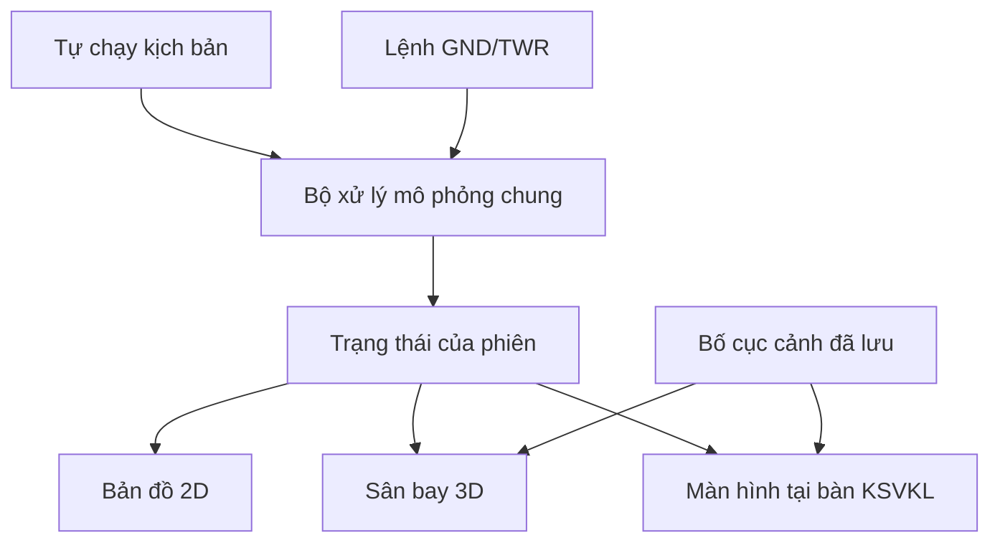

# Bàn giao Web 3D — Luna và Antigravity

Ngày ghi nhận: 23/09/2026.

**Trạng thái: yêu cầu và kế hoạch triển khai đã chốt trong hội thoại; không phải báo cáo Web 3D đã hoàn thành.**

Đây là tài liệu ưu tiên cho công việc Web 3D, thay thế các quyết định nền tảng trong kế hoạch Unity trước đây. Khi người dùng đưa yêu cầu mới, cập nhật tài liệu này trước khi thay đổi phạm vi. Đọc [AGENTS.md](../AGENTS.md) trước khi triển khai.

## 1. Các quyết định của người dùng

| Nội dung | Đã chốt |
| --- | --- |
| Nền tảng | Web 3D là bản chính; Unity giữ làm tham khảo và nguồn tài sản |
| Bản 2D | Giữ chức năng, giao diện và hành vi hiện có; được tích hợp và tách logic cần thiết để dùng chung với 3D |
| Chế độ sử dụng | Tự chạy kịch bản và thực hành GND/TWR |
| Người điều hành | Một người chuyển vai GND/TWR trước; nhiều người phối hợp làm sau |
| Thiết bị | Laptop, điện thoại, máy tính bảng |
| Camera | Toàn sân, bốn góc đặt sẵn, theo máy bay, toàn phòng KSVKL, ngồi tại bàn GND và TWR |
| Chỉnh sửa | Sắp đặt mô hình, đèn, vật liệu, camera và lưu bố cục; không yêu cầu trình tạo tuyến/kịch bản mới |
| Chỉnh trên cảm ứng | Phải có đầy đủ chức năng chỉnh bố cục, không chỉ xem |
| Hình ảnh | Sa bàn sân bay chi tiết và phòng KSVKL theo bố cục ảnh tham khảo; nâng cấp UI/UX và độ chi tiết dần |
| Thứ tự ưu tiên | Đúng luồng, đồng bộ dữ liệu, thao tác và lưu được trước; nâng cấp hình thức sau |
| Phần cứng | Không làm sa bàn vật lý, LED thật, firmware hoặc cơ điện |

Chưa chốt máy kiểm thử cụ thể, cấu hình GPU/RAM, trình duyệt mục tiêu cuối cùng, yêu cầu offline và nhà cung cấp API. Không mặc định mọi thiết bị chạy mượt hoặc offline đã được hỗ trợ. Ghi lại môi trường thực tế khi kiểm thử.

Không tự bổ sung backend, đăng nhập, dịch vụ trả phí, API chuyến bay thật hoặc multiplayer trong bản đầu. Không tự xuất bản website khi chưa có yêu cầu triển khai/publish.

## 2. Khảo sát dự án trước khi sửa

Đọc và đối chiếu mã thực tế với:

- `src/App.tsx`, `src/types.ts`, `src/simulation/`, `src/data/scenarios/`.
- `src/data/airportGraph.v3.ts` và graph đang được chọn trong ứng dụng.
- `src/components/AirportMap.tsx`.
- `src/components/Scenario1ComparisonView.tsx`, `src/components/ScenarioComparisonView.tsx`.
- [Rule inventory](rule_inventory.md), [traceability matrix](rule_traceability_matrix.md).
- [Sơ đồ kịch bản](mermaid_graph_v3_scenarios.md), [swimlane KSVKL](luong_ksvkl_swimlane.md).
- [Trạng thái Unity cũ](../airport-3d/STATUS.md), tài sản và script Blender trong `airport-3d/`.

Quan sát khi lập tài liệu: package web có React, TypeScript, Vite, Three.js; chưa thấy khai báo React Three Fiber/Drei trong `package.json`. Kiểm tra lại phiên bản và mã nguồn khi bắt đầu, không dùng thông tin này như ảnh chụp trạng thái bất biến.

Vòng chạy chính nằm trong `App.tsx`; kịch bản 1 và 5 còn có các màn so sánh với trạng thái riêng. Không chỉ lấy các hàm `setup()` rồi coi là đã tái hiện toàn bộ kịch bản.

Lập danh sách logic tái sử dụng, logic đang nằm trong UI, các vòng chạy riêng, tài sản dùng lại được và lỗi hiện có. Tiếp tục triển khai sau khảo sát; không dừng ở bản kế hoạch.

## 3. Kiến trúc: một phiên mô phỏng, nhiều góc nhìn

- Logic thời gian, tuyến, trạng thái, quyền điều hành và điều kiện chuyển bước thuộc lớp mô phỏng.
- 2D, 3D, camera, hiệu ứng và bảng thao tác thuộc lớp hiển thị.
- Bố cục trang trí, vật liệu và camera lưu riêng khỏi trạng thái máy bay đang chạy.
- Một bộ điều phối thời gian cập nhật mỗi phiên. Không để renderer 2D và renderer 3D mỗi bên tự gọi tick.
- Chuyển góc nhìn, resize hoặc đổi tab hiển thị không reset phiên, nhân đôi tick hay tạo lại máy bay.
- Được nội suy chuyển động cho mượt, nhưng không dùng vị trí nội suy làm nguồn quyết định nghiệp vụ.
- Màn so sánh truyền thống/FTG có hai phiên độc lập có ID rõ ràng. Mỗi góc nhìn phải chỉ rõ đang theo phiên nào; đổi renderer không thêm phiên mới.
- Hiển thị và lệnh điều hành phải dùng cùng đối tượng trạng thái; không đồng bộ bằng cách chép lại danh sách máy bay theo hai thuật toán riêng.
- Bảo toàn quy tắc pause/resume, đổi tốc độ và xử lý tab ẩn khi tách vòng chạy hiện có.

Có thể refactor tối thiểu phần 2D để chia sẻ logic, nhưng phải giữ hành vi và kiểm tra hồi quy. Quy định cũ “không sửa src” của giai đoạn Unity không áp dụng cho tích hợp Web 3D mới.

## 4. Công nghệ và tài sản

- Giữ React + TypeScript + Vite; ưu tiên Three.js + React Three Fiber + Drei sau khi kiểm tra tương thích phiên bản.
- Không nâng cấp hàng loạt thư viện ngoài nhu cầu tích hợp.
- Dùng GLB/glTF cho tài sản Blender phù hợp. Không giả định scene Unity, C# hay shader Unity chạy trực tiếp trên web.
- Quy định đơn vị, trục, gốc tọa độ, hướng mũi máy bay và độ cao nền ở một nơi dùng chung.
- Không thêm physics engine chỉ để di chuyển máy bay theo tuyến xác định.
- Mô hình cần có ID ổn định và khả năng thay thế tài sản mà không sửa thuật toán mô phỏng.
- Không coi “cài Three.js/R3F” là đã dựng xong sân bay hay có editor tương đương Unity.

## 5. Chế độ tự chạy — đủ năm kịch bản

Đối chiếu bằng ID thực tế trong source; số thứ tự tài liệu và tên file có thể khác nhau.

| Chủ đề | File cần khảo sát |
| --- | --- |
| Rẽ nhầm tuyến | `src/data/scenarios/scenario1_wrongTurn.ts` |
| Xung đột HS-NS | `src/data/scenarios/scenario3_hsnsConflict.ts` |
| Cháy động cơ/khẩn nguy | `src/data/scenarios/scenario2_emergencyFire.ts` |
| FOD, đóng đường lăn | `src/data/scenarios/scenario4_fodClosure.ts` |
| Đổi hướng đường băng | `src/data/scenarios/scenario5_runwayChange.ts` |

Mỗi bài phải có chọn, bắt đầu, pause, resume, restart và điều chỉnh tốc độ. Máy bay, vị trí, tuyến, điểm giữ, thời điểm release, sự kiện, trạng thái kết thúc phải được đối chiếu với đúng phiên 2D đang sử dụng.

Lập bảng các mốc sự kiện quan trọng và bằng chứng cho mỗi bài. Cần kiểm tra diễn biến, không chỉ đếm máy bay, kiểm tra route hoặc hiển thị tên bài. Nếu mô tả tài liệu khác hành vi thực tế, ghi rõ trước khi sửa quy tắc; không âm thầm thay hành vi 2D để làm kiểm thử 3D đạt.

Có nhật ký dễ đọc. Đổi camera không thay đổi tiến trình. Giữ nhánh so sánh truyền thống/FTG nếu hiện có; đánh giá cách chọn phiên để hiển thị 3D.

## 6. Chế độ thực hành GND/TWR

Dùng cùng mô hình trạng thái và quy tắc hợp lệ với tự chạy, nhưng các quyết định cần người điều hành phải chờ lệnh. Không âm thầm tự cấp lệnh trong chế độ thực hành.

Luồng chung: chọn máy bay → xem phiếu bay → chọn hành động hợp lệ → xác nhận/readback theo mô hình bài → cập nhật đồng thời các góc nhìn.

Phiếu bay gồm hiệu gọi, vị trí, tuyến, đích/stand, người kiểm soát, yêu cầu hiện tại và trạng thái lệnh.

Các bước cần thiết:

- Pushback, kiểm tra khu vực và trạng thái tug khi bài yêu cầu.
- Cấp tuyến taxi, giữ, cho tiếp tục và xử lý tuyến đóng.
- Máy bay đến: TWR xử lý phần đường băng, bàn giao GND sau khi rời; GND cấp đường về stand và xác nhận đã đỗ trong phạm vi bài.
- Máy bay đi: GND xử lý stand/pushback/taxi tới điểm chờ, đề nghị bàn giao; TWR tiếp nhận và xử lý bước đường băng.
- Bàn giao có đề nghị, tiếp nhận/từ chối; không đổi người kiểm soát chỉ vì đổi camera hoặc đổi tab vai trò.
- Kiểm tra quyền và trạng thái trước khi nhận lệnh. Không để máy bay vào đường băng khi bước xác nhận bắt buộc chưa hoàn tất.
- Nêu lý do hành động bị từ chối; xử lý readback theo thiết kế bài, không chỉ hiển thị nút xác nhận trang trí.
- Các tình huống rẽ nhầm, HS-NS, cháy, FOD và đổi runway có điểm tương tác rõ ràng.

Quy tắc phục vụ mô phỏng giáo dục, đối chiếu rule inventory và swimlane. Không tự coi là quy trình nghiệp vụ được phê chuẩn. Nếu cần bổ sung quy tắc thực hành chưa có trong tự chạy, ghi rõ bổ sung, kiểm thử riêng và không làm thay đổi nhánh tự chạy đã chốt.

## 7. Sân bay 3D và hình ảnh tham khảo

Theo graph hiện có: đường băng, đường lăn, sân đỗ, stand, vạch tim, điểm chờ, biển chỉ dẫn, máy bay, đèn FTG, stop bar, nhà ga, tháp và cảnh quan.

Ảnh sa bàn người dùng gửi: đế trưng bày, sân bay nhìn nghiêng, cây/cỏ, máy bay và đèn đường nổi bật. Ảnh phòng KSVKL: góc đứng phía sau dãy bàn, kính lớn nhìn ra sân bay, nhiều màn hình console, ghế, thiết bị và bảng treo phía trên.

**Ảnh gốc nằm trong hội thoại; chưa xác nhận có bản ảnh tham khảo lưu trong repo. Không bịa đường dẫn, không dùng ảnh QA của prototype thay cho ảnh mẫu.** Có thể triển khai bố cục theo mô tả này; nếu cần đối chiếu trực tiếp mà không có ảnh trong ngữ cảnh, ghi rõ việc thiếu ảnh.

Ưu tiên đúng tuyến, tỷ lệ và khả năng quan sát. FTG/stop bar đọc trạng thái nghiệp vụ; màu vật liệu chỉnh trong editor không được làm đèn báo trái trạng thái. Độ chi tiết được nâng cấp dần; không cam kết ảnh chân thật trên mọi máy.

## 8. Phòng KSVKL và các camera

- Toàn sân: xoay 360°, pan, zoom, bốn góc đặt sẵn và trở về toàn cảnh.
- Theo máy bay đang chọn; có cách thoát về toàn sân.
- Toàn phòng KSVKL: thấy dãy console và sân bay qua cửa kính.
- Góc ngồi tại bàn GND; góc ngồi tại bàn TWR.
- Chuyển góc ổn định; tránh xuyên sàn, kính, tường, mô hình hoặc mất đối tượng khỏi khung.
- Đổi camera không tự động cấp quyền điều hành. Có thể có nút chuyển bàn/vai, nhưng phải thể hiện rõ tác động đó.
- Sân bay bên ngoài kính là cảnh đang chạy. Màn hình radar/phiếu bay tại bàn dùng trạng thái thật của phiên; không dùng ảnh chụp cố định thay đồng bộ.
- Chọn màn hình console được mở bảng thao tác lớn, dễ đọc và bấm trên điện thoại.

### Điều khiển đã chốt cho Web 3D

| Thao tác | Kết quả |
| --- | --- |
| Lăn con lăn trên vùng cảnh | Phóng to/thu nhỏ |
| Giữ chuột trái kéo vùng trống | Xoay sa bàn |
| Giữ chuột phải kéo vùng cảnh | Dịch chuyển góc nhìn (pan) |
| Bấm Toàn cảnh | Đặt lại camera bao quát sân bay |
| Góc 1–4 | Chọn bốn góc quanh sa bàn, cách nhau 90° |
| Chụm/tách hai ngón | Thu/phóng trên cảm ứng |
| Một ngón kéo vùng trống | Xoay trên cảm ứng |
| Hai ngón kéo | Pan trên cảm ứng, phối hợp với pinch |
| Click/chạm đối tượng | Chọn đối tượng; phân biệt với kéo camera |

Chặn menu chuột phải chỉ trong vùng cảnh khi cần pan. Cuộn trên panel cuộn panel, không đồng thời zoom cảnh. Trong phòng/bàn điều hành dùng giới hạn camera phù hợp, không áp orbit toàn sân khiến xuyên tường. Khi kéo gizmo chỉnh vật thể, tạm khóa camera; khôi phục đúng khi kết thúc hoặc hủy thao tác. Hỗ trợ pointer capture và tình huống mất focus/cancel để không bị kẹt kéo.

## 9. Chỉnh bố cục trên chuột và cảm ứng

Tách chế độ chỉnh sửa khỏi phiên vận hành. Chuyển vào editor phải có quy tắc tạm dừng rõ ràng.

Chức năng đầy đủ:

1. Chọn từ cảnh hoặc danh sách đối tượng.
2. Di chuyển, xoay, đổi kích thước đối tượng được phép.
3. Chỉnh vật liệu, màu, thuộc tính ánh sáng phù hợp.
4. Đặt và lưu camera.
5. Undo/redo; một thao tác kéo nên là một bước hoàn tác, không hàng trăm bước theo frame.
6. Lưu, tải lại, khôi phục mặc định, xuất/nhập file bố cục.
7. Kiểm tra file nhập: schema/version, ID tài sản, giá trị hữu hạn, giới hạn hợp lệ; lỗi nhập không phá bố cục hiện tại.

Laptop có gizmo và inspector. Điện thoại/máy tính bảng có bảng thuộc tính mở được, ô nhập số, nút dịch chuyển/xoay theo bước và danh sách chọn đối tượng; không phụ thuộc hover hoặc chuột phải. Cùng khả năng chỉnh, không bắt buộc cùng bố cục UI.

Bố cục lưu có phiên bản, ID ổn định và tham chiếu tài sản. Chọn lưu cục bộ phù hợp và xuất/nhập JSON; không mặc định dữ liệu tự đồng bộ giữa thiết bị. Tải lại trang phải khôi phục được bố cục đã lưu trên thiết bị đó.

Ràng buộc:

- Ghế, vật trang trí, camera và mô hình phù hợp được chỉnh tự do.
- Tim đường lăn, điểm chờ, stand, đèn nghiệp vụ phải bám dữ liệu sân bay; không kéo làm lệch graph đang chạy.
- Máy bay đang vận hành nhận vị trí từ mô phỏng, không bị editor ghi đè.
- Cho phép chỉnh phần trình bày của đèn nhưng trạng thái bật/tắt/màu nghiệp vụ thuộc mô phỏng.
- Trình tạo tuyến/kịch bản mới không nằm trong phạm vi editor lần này.

## 10. Hiệu năng và khả năng nâng cấp UI/UX

Tách component bảng thao tác, camera, renderer, tài sản, cấu hình vật liệu và dữ liệu bố cục. Nâng cấp giao diện hoặc thay model không được viết lại thuật toán kịch bản.

Có cấu hình chất lượng theo thiết bị. Giảm độ phân giải render, bóng đổ, phản chiếu và chi tiết xa khi cần; không giảm tính đúng của mô phỏng. Tái sử dụng hình học/vật liệu, cân nhắc instancing cho nhiều đèn/cây, không tạo hàng nghìn nguồn sáng động chỉ để đèn trông sáng.

Giao diện bản đầu có thể đơn giản nhưng phải đọc được, chọn được, không che hết cảnh, không mất nút ở màn hình nhỏ. Phân biệt rõ chế độ tự chạy/thực hành/chỉnh sửa. Đo thời gian tải, khung hình và khả năng thao tác trên môi trường thực tế; không đưa cam kết FPS chưa đo.

API và nhiều người dùng là khả năng mở rộng, không phải nhiệm vụ bản đầu. Không giả định API chuyến bay công cộng cung cấp đủ dữ liệu đường lăn hoặc clearance. Không để dữ liệu thật ghi đè bài mô phỏng khi chưa thiết kế chính sách riêng.

## 11. Trình tự thực hiện và phân công đề xuất

Phân công dưới đây là đề xuất tổ chức để giao hai công cụ, không có nghĩa chúng đã được chạy hoặc đã nhận nhiệm vụ.

| Giai đoạn | Luna phụ trách | Antigravity phụ trách | Điều kiện kết thúc |
| --- | --- | --- | --- |
| 0. Khảo sát | Xác định phiên, tick, nhánh so sánh, contract dữ liệu | Kiểm kê assets, camera, UI và thiết bị | Thống nhất ID, tọa độ, command, snapshot và cấu trúc file |
| 1. Đồng bộ | Tách logic chung, nối đủ năm bài, bảo toàn 2D | Renderer 3D tối giản dùng contract đã thống nhất | Đổi 2D/3D giữ phiên; đối chiếu các mốc của năm bài |
| 2. Cảnh/camera | Kiểm tra đèn và vị trí theo trạng thái | Sân bay, tài sản, phòng KSVKL, camera/chuột/cảm ứng | Nhìn được cảnh, chọn máy bay, màn console hiển thị phiên thật |
| 3. Thực hành | Quyền GND/TWR, lệnh, readback, bàn giao | Phiếu bay, bảng lệnh, phản hồi lỗi, góc bàn | Chờ lệnh đúng; sai vai/sai bước bị từ chối |
| 4. Editor | Ràng buộc dữ liệu với graph, kiểm tra import | Chọn/chỉnh/lưu, undo/redo, inspector cảm ứng | Lưu/tải và chỉnh trên cả desktop/cảm ứng không làm sai phiên |
| 5. Tích hợp | Tích hợp cuối, kiểm thử mô phỏng, hồi quy | Kiểm thử trình duyệt, thao tác, responsive, hình ảnh | Build/lint phù hợp, kiểm tra hành vi, docs và giới hạn đầy đủ |

Luna là đầu mối tích hợp đề xuất. Trước khi làm song song, ghi danh sách file mỗi bên sở hữu và contract vào kế hoạch làm việc. Tránh cả hai cùng sửa `App.tsx`, `src/types.ts`, `package.json` và lockfile; chỉ một đầu mối áp dụng thay đổi vào các file chung. Không tạo hai renderer/engine độc lập rồi ghép vội ở cuối.

Nếu dùng cùng thư mục làm việc, phải thông báo bàn giao file trước khi đổi người sửa. Nếu dùng hai branch/worktree, thống nhất contract trước, kiểm tra tích hợp từng giai đoạn. Không ghi đè thay đổi có sẵn không thuộc nhiệm vụ.

Hoàn thành từng giai đoạn có kết quả chạy được rồi tiếp tục; không dừng để hỏi “có làm tiếp không” cho công việc đã nằm trong phạm vi. Chỉ hỏi khi thiếu quyết định thật sự ảnh hưởng kết quả, chi phí hoặc hành động không thể đảo ngược.

## 12. Nghiệm thu và bằng chứng

| Mã | Điều kiện cần xác nhận |
| --- | --- |
| A01 | Chuyển 2D/3D không reset, tạo máy bay trùng hoặc nhân đôi tốc độ |
| A02 | Vị trí, hướng, trạng thái, đèn và sự kiện của cùng phiên khớp giữa các góc nhìn |
| A03 | Năm bài chạy qua các mốc đối chiếu; nhánh so sánh được nối đúng phiên |
| A04 | Pause/resume/restart/tốc độ nhất quán, không phụ thuộc camera/FPS |
| A05 | Thực hành thật sự chờ lệnh; tự chạy vẫn hoạt động như đã chốt |
| A06 | Sai vai/sai bước bị từ chối; bàn giao không xảy ra chỉ vì đổi camera |
| A07 | Màn hình trong phòng KSVKL phản ánh phiên đang chạy |
| A08 | Chuột và cảm ứng dùng được: zoom, orbit, pan, preset; không tranh thao tác với UI/editor |
| A09 | Đủ góc toàn sân/theo máy bay/toàn phòng/GND/TWR; không mắc camera trong mô hình |
| A10 | Chỉnh bố cục không ghi đè máy bay, graph, đèn nghiệp vụ |
| A11 | Save/reload, import/export, undo/redo và reset bố cục hoạt động; import lỗi không làm mất cảnh |
| A12 | Trên màn hình nhỏ có đủ chức năng thực hành và editor; không chỉ xem |
| A13 | Build thành công; lint theo repo; không có lỗi runtime nghiêm trọng hoặc asset bắt buộc bị thiếu |
| A14 | Hành vi 2D liên quan không bị hồi quy |
| A15 | Báo cáo nêu rõ máy/trình duyệt thật, thiết bị giả lập, số liệu hiệu năng và phần chưa kiểm tra |

Chạy `npm run build`, `npm run lint` theo hướng dẫn repo; ghi riêng lỗi có sẵn và lỗi do thay đổi. Thiết kế kiểm thử có ý nghĩa cho logic và dữ liệu chung. Kiểm tra UI bằng trình duyệt thực tế, không chỉ bằng TypeScript.

Ảnh chụp chỉ chứng minh bố cục hiển thị. Đếm máy bay hoặc route hợp lệ không chứng minh toàn bộ sự kiện. Viewport giả lập không chứng minh hiệu năng GPU/cảm ứng của điện thoại thật.

## 13. Kết quả bàn giao cần có

- Source Web 3D tích hợp và cách chạy từ repo.
- Hướng dẫn chọn 2D/3D, từng bài, tự chạy/thực hành, bàn GND/TWR, camera và editor.
- Hướng dẫn lưu/khôi phục và chuyển bố cục qua file giữa thiết bị.
- Báo cáo kiểm thử theo A01–A15, log/ảnh hoặc bằng chứng phù hợp.
- Bảng chức năng: đã làm / đã kiểm tra / còn thiếu, kèm giới hạn thực tế.
- Cấu trúc module/tài sản để nâng cấp UI/UX, vật liệu, ánh sáng và model về sau.

Khi bị chặn, ghi rõ nguyên nhân và tiếp tục phần độc lập có thể làm; không báo hoàn tất thay cho công việc còn thiếu. Không dùng báo cáo build Unity cũ để chứng minh Web 3D hoạt động.

## 14. Nguồn giải thích công nghệ đã tham khảo

Các nguồn dưới đây giải thích công cụ; không phải cam kết toàn bộ editor chỉ cần vài dòng code.

- [OrbitControls](https://threejs.org/docs/pages/OrbitControls.html): orbit/zoom/pan và cảm ứng.
- [TransformControls](https://threejs.org/docs/pages/TransformControls.html): gizmo biến đổi đối tượng.
- [R3F scaling performance](https://r3f.docs.pmnd.rs/advanced/scaling-performance): tối ưu và chất lượng theo thiết bị.
- [GLTFLoader](https://threejs.org/docs/pages/GLTFLoader.html): tải tài sản glTF.
- [Triplex](https://triplex.dev/): công cụ chỉnh trực quan cho người phát triển, không thay editor người dùng cần trong ứng dụng.
- [Vite features](https://vite.dev/guide/features.html): HMR; không suy ra mọi tác vụ nhanh gấp 5–10 lần.

Prompt giao việc ngắn nằm trong [prompt_luna_antigravity_web_3d.md](prompt_luna_antigravity_web_3d.md). Khi giao cho agent ngoài cuộc trò chuyện, gửi kèm tài liệu này và ảnh tham khảo nếu có.
