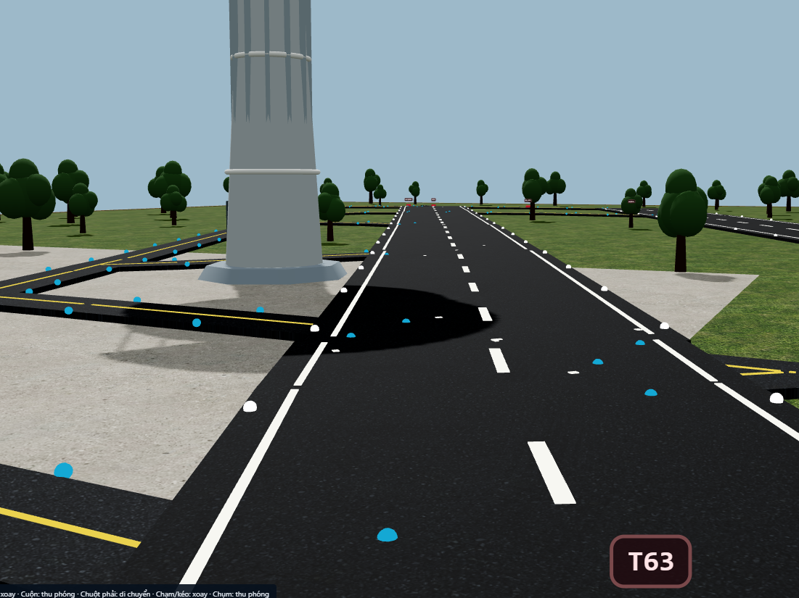
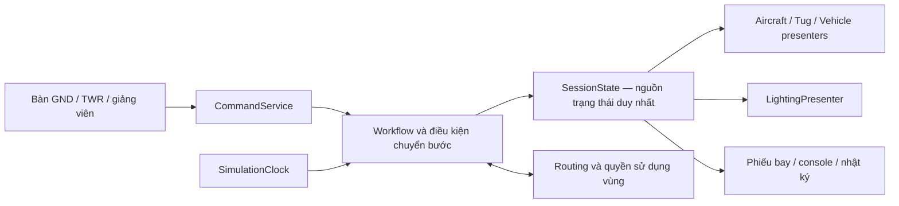

# Kế hoạch triển khai 3D và bàn giao cho Luna

> **Kế hoạch Unity cũ — chỉ tham khảo.** Người dùng đã chọn Web 3D làm bản chính, cùng trạng thái với 2D, hỗ trợ laptop và cảm ứng, tự chạy/thực hành và editor bố cục. Đọc [đặc tả bàn giao hiện hành](ban_giao_web_3d_luna_antigravity.md) và [prompt Luna/Antigravity](prompt_luna_antigravity_web_3d.md). Các chỉ dẫn bên dưới về Unity là nền tảng chính, chỉ desktop, không sửa `src/` và hoãn đồng bộ 2D–3D đã bị thay thế. Giữ nội dung cũ để tra cứu lịch sử/tài sản.

Ngày chốt hiện trạng: 23/09/2026. Chủ dự án yêu cầu lập kế hoạch để giao Luna thực hiện. Tài liệu này không khẳng định những hạng mục tương lai đã được triển khai.

## Cập nhật ưu tiên: phong cách sa bàn theo ảnh người dùng

Người dùng đã gửi ảnh tham chiếu sau khi kế hoạch ban đầu được viết. **Đích hình ảnh là sa bàn sân bay thu nhỏ trưng bày**, nhìn nghiêng toàn cảnh, có đế, nền cỏ/cây, đường băng/đường lăn/sân đỗ, máy bay nhỏ và đèn nổi bật. Đây là yêu cầu hình ảnh mới nhất, ưu tiên hơn các giả định trước đó về cảnh sân bay toàn tỷ lệ nhìn từ mặt đất.

**Phạm vi cuối cùng người dùng đã làm rõ: CHỈ SA BÀN 3D TRÊN MÁY TÍNH, máy bay tự chạy trong mô phỏng. Không làm sa bàn vật lý, LED thật, firmware hoặc cơ điện.** Xác nhận này thay thế câu trả lời trước đó về cả hai loại sa bàn. Tài liệu `ke_hoach_sa_ban_led.md` đã được đánh dấu ngoài phạm vi, không thực hiện các nhiệm vụ trong đó. Ảnh có trong hội thoại, chưa có bản lưu riêng trong repo; không bịa đường dẫn ảnh. Xem [đặc tả sa bàn theo ảnh](dinh_huong_sa_ban_3d.md) trước khi triển khai hình ảnh.

Thứ tự ưu tiên điều chỉnh: **A xác minh prototype → B02/B03 khóa dữ liệu/tọa độ → dựng sa bàn toàn cảnh theo đặc tả mới → một lượt điều hành hoạt động trên sa bàn → hoàn thiện các luồng còn lại**. Phòng điều hành chi tiết C04 làm sau khi sa bàn chính đạt yêu cầu hình; giao diện điều khiển cần thiết vẫn phải có từ đầu.

## 1. Mục tiêu và giới hạn công việc

Hoàn thiện mô phỏng 3D sân bay dựa trên graph TSN hiện có, gồm sân bay có chi tiết, máy bay và phương tiện chuyển động, phòng KSVKL có bàn GND/TWR, cùng các luồng điều hành tương tác được. Các màn hình, đèn và vật thể dùng chung trạng thái mô phỏng.

Yêu cầu đã chốt:

1. **Không sửa phần mềm 2D lúc này.** Mã `src/`, các dependency web và cấu hình web là nguồn tham chiếu, không phải phạm vi sửa.
2. Dùng **Blender để tạo mô hình và Unity để vận hành 3D**. Có thể tự tạo model bằng script; không bắt buộc tải model ngoài.
3. Người dùng muốn nhiều chi tiết. Cần đánh giá hình ảnh ở góc gần, không chỉ đếm số vật thể hoặc có file FBX.
4. Làm cả luồng người điều hành, phi công mô phỏng và đội mặt đất; không chỉ cho máy bay tự chạy theo tuyến.
5. Kết nối **phòng KSVKL 3D ↔ sân bay 3D** thuộc sản phẩm hiện tại. Kết nối live **web 2D ↔ Unity** thuộc giai đoạn sau, chỉ chuẩn bị ranh giới dữ liệu lúc này.
6. Đây là mô phỏng giáo dục. Tên sân bay và graph không đồng nghĩa mô hình kiến trúc hoặc quy trình đã được xác nhận chính xác ngoài thực tế.

Mặc định để Luna có thể làm tiếp: Windows desktop, một người có thể đổi bàn GND/TWR, màn hình chuột/phím, không VR và không multiplayer trong đợt đầu. Tự xử lý quyết định kỹ thuật có thể đảo ngược; chỉ hỏi khi thiếu dữ liệu ảnh hưởng trực tiếp đến kết quả.

## 2. Hiện trạng thực tế — đọc trước khi sửa

### 2.1 Đã có

| Thành phần                  | Vị trí                                          | Tình trạng                                                                  |
| --------------------------- | ----------------------------------------------- | --------------------------------------------------------------------------- |
| Thiết kế tổng thể, 18 luồng | `docs/thiet_ke_3d_unity_blender.md`             | Đặc tả, không phải báo cáo chức năng hoàn tất                               |
| Sơ đồ trao đổi GND/TWR      | `docs/luong_ksvkl_swimlane.md`                  | Tham khảo; không thực hiện đề xuất sửa web trong tài liệu này               |
| Project Unity               | `airport-3d/unity/`                             | Đã biên dịch và build Windows                                               |
| Xuất graph đã resolve       | `airport-3d/tools/export-layout.cjs`            | Xuất 121 nodes, 136 edges ở lần chạy gần nhất                               |
| Layout JSON                 | `unity/Assets/AirportSim/Resources/layout.json` | Có schemaVersion, graphHash, đơn vị, nodes và edges                         |
| Bộ tạo model Blender        | `airport-3d/art-source/build_assets.py`         | Tạo máy bay minh họa A321, tug, tháp                                        |
| Tài sản Blender             | `airport-3d/art-source/airport-assets.blend`    | Source đã tạo; cần tiếp tục chỉnh mỹ thuật                                  |
| Model FBX                   | `unity/Assets/AirportSim/Resources/Models/`     | Có ba model; chưa đủ toàn bộ danh mục sản phẩm                              |
| Domain mô phỏng             | `Scripts/Domain/AirportSession.cs`              | Hai máy bay, pushback, taxi, hold, bàn giao, line-up, takeoff, FOD, cờ cháy |
| Cảnh và UI runtime          | `Scripts/Presentation/AirportWorld.cs`          | Sinh sân bay, console, camera, đèn; UI hiện dùng OnGUI                      |
| Shader màn hình             | `Resources/Monitor.shader`                      | Đã sửa lỗi thiếu shader khi đóng gói                                        |
| Tạo scene/build             | `Editor/BuildAirport.cs`                        | Menu `Airport 3D`; build gọi kiểm tra domain trước                          |
| Kiểm tra domain             | `Editor/DomainChecks.cs`                        | Log lần cuối: `DOMAIN_CHECKS_OK 29`                                         |
| Bản Windows                 | `airport-3d/Builds/Windows/TSN-Surface-Lab.exe` | Log lần cuối: `AIRPORT_BUILD_OK`; giữ toàn bộ thư mục bên cạnh exe          |

Các đường dẫn `unity/...` và `Scripts/...` trong bảng là tương đối dưới `airport-3d/` và `unity/Assets/AirportSim/` tương ứng.

### 2.2 Những điều chưa được xác nhận

- Lần chạy thực tế đầu tiên lỗi shader màn hình console; đã sửa và build lại thành công. **Chưa hoàn tất kiểm tra ảnh/runtime sau bản sửa cuối.**
- Kiểm tra domain đã qua không chứng minh UI, import FBX, tỷ lệ, hướng máy bay, FPS và hiệu ứng đều đúng.
- Scene chủ yếu được tạo trong `Start()`. Mở scene trong Editor trước Play chưa thấy toàn bộ sân bay là hành vi hiện tại, cần cải thiện công cụ preview.
- Chưa có kết nối live với web, chưa có replay hoàn chỉnh, chưa có mô hình cứu hỏa hoàn chỉnh hoặc tất cả 18 luồng.
- Model máy bay mới là minh họa procedural. Chưa đạt tiêu chí máy bay chi tiết được nghiệm thu.
- Bản đầu dùng **Built-in Render Pipeline**, chưa dùng URP như mục tiêu trong đặc tả. Phải ghi nhận rõ; chỉ chuyển sau khi có ảnh đối chiếu và test vật liệu.
- Ở lần kiểm kê cuối có process `TSN-Surface-Lab` PID 9244 còn tồn tại. PID có thể thay đổi hoặc tái sử dụng; kiểm tra executable path trước khi đóng helper do phiên này tạo. Không đóng Unity/ứng dụng khác của người dùng.

### 2.3 Môi trường đã phát hiện

```text
Workspace: D:\Thao\airport-simulator
Blender: C:\Program Files\Blender Foundation\Blender 5.1\blender.exe
Unity: C:\Program Files\Unity\Hub\Editor\2022.3.62f1-x86_64\2022.3.62f3\Editor\Unity.exe
Unity project: D:\Thao\airport-simulator\airport-3d\unity
Unity version: 2022.3.62f3
```

Người dùng đã kích hoạt license; build sau đó thành công. Không yêu cầu kích hoạt lại trừ khi log mới thực sự báo thiếu license. Runtime đã ghi nhận Intel UHD Graphics; không coi bộ nhớ đồ họa chia sẻ là VRAM chuyên dụng. Cần đo hiệu năng thực tế.

## 3. Cách làm việc dành cho Luna

1. Đọc `AGENTS.md`, tài liệu này và đặc tả 3D. Đọc đúng file liên quan trước mỗi bước; không dựng lại từ đầu.
2. Làm theo thứ tự chặng bên dưới. Mỗi chặng phải có đầu ra kiểm tra được và cập nhật checklist.
3. Không báo “hoàn tất 3D” chỉ vì compile/build pass. Luôn phân biệt: code đã viết, test đã qua, ảnh đã xem, phần chưa kiểm chứng.
4. Không viết lại bộ domain và bộ hiển thị cùng lúc. Giữ build chạy được sau mỗi thay đổi lớn.
5. Không thêm package, pipeline hoặc plugin chỉ vì chúng có tên trong thiết kế. Ghi rõ nhu cầu, phiên bản tương thích và ảnh hưởng trước khi thêm; không tự nâng Unity.
6. Giữ `.meta` của Unity ổn định. Không commit `Library/`, `Temp/`, log hay build cache. Không xóa model/source cũ trước khi xác minh bản thay thế.
7. Không đụng file 2D để “tiện đồng bộ”. Nếu gặp thiếu dữ liệu, tạo adapter/exporter hoặc dữ liệu bổ sung trong `airport-3d/`.
8. Cập nhật ngắn gọn tiến độ trong khi làm; không hỏi lại quyền thực hiện công việc đã nằm trong phạm vi này.
9. Kết thúc mỗi chặng bằng báo cáo: file thay đổi, cách thử, kết quả, ảnh và hạn chế còn lại. Chỉ tiếp tục chặng sau khi điều kiện đầu vào đã đạt.

## 4. Kiến trúc đích



Quy tắc cốt lõi:

- Một phiên có một đồng hồ, một chủ sở hữu trạng thái, một owner cho mỗi máy bay.
- Renderer không tự chọn ưu tiên, tính clearance hoặc kết thúc một nhiệm vụ.
- Click nút gửi command; domain chấp nhận/từ chối; view phản ánh kết quả.
- Camera khác nhau và màn hình console cùng xem một phiên, không chạy thêm engine.
- Preview tuyến khác tuyến được cấp; đèn xanh không thay quyền vào runway.
- Dùng mét, m/s, giây trong domain; chỉ đổi đơn vị tại giao diện hoặc importer.
- Khóa các định danh ổn định: aircraftId, edgeId, standId, clearanceId, commandId, sessionId.

## 5. Chặng A — Xác minh prototype, xử lý lỗi trước khi thêm tính năng

### A01. Kiểm kê và lập mốc đối chiếu

**Đọc:** `AirportSession.cs`, `AirportWorld.cs`, `BuildAirport.cs`, `DomainChecks.cs`, manifest và build/runtime log.

**Làm:**

- Xác minh build mới nhất đúng source hiện tại; kiểm tra process còn chạy và file bị khóa.
- Ghi graphHash, Unity version, Blender version, ngày build, tên GPU.
- Tạo `airport-3d/STATUS.md` và `airport-3d/QA/checklist.md` để theo dõi trạng thái từng nhiệm vụ.
- Liệt kê những test hiện có và những hành vi chưa được test; không đổi tên 29 test thành “toàn bộ hệ thống”.

**Xong khi:** có bản ghi hiện trạng và không có thay đổi ngoài phạm vi 3D/tài liệu.

### A02. Chạy lại smoke test và xem ảnh

**Làm:**

- Chạy exe với `--smoke`, giữ đồ họa bật; không dùng `-nographics` cho kiểm tra hình.
- Kiểm tra `runtime.log` không có exception, missing shader/model hoặc lỗi GUI.
- Mở và xem ba ảnh `01-overview.png`, `02-aircraft.png`, `03-control-room.png` trong thư mục `Builds/QA/` theo code hiện tại.
- Kiểm tra tỷ lệ, hướng mũi/càng/bánh, màu vật liệu, vạch đường, màn hình console, font tiếng Việt, khả năng đọc nút ở 1600×1000 và 1366×768.
- Thử chuyển camera, chọn tàu bằng click, chọn bàn, pause, reset.

**Xong khi:** cả ba góc nhìn hiển thị được; không lỗi runtime; có ảnh đã kiểm tra. Nếu fail, chỉ sửa vấn đề này trước.

### A03. Sửa các điểm yếu đã nhận diện trong prototype

Đây là danh sách cần kiểm tra bằng test, không kết luận mọi mục đã gây lỗi trong phiên chạy:

| Điểm cần xử lý                                         | Cách xác minh / yêu cầu sửa                                                                           |
| ------------------------------------------------------ | ----------------------------------------------------------------------------------------------------- |
| `FindRoute` trả node rồi `Edge(a,b)` tìm cạnh đầu tiên | Kiểm tra cạnh song song; route phải lưu edgeId thực tế đã chọn, không tự chọn lại cạnh đóng           |
| Kiểm tra hai tàu chỉ bằng khoảng cách `Any(...)`       | Thử hai tàu cùng tới giao lộ/đi ngược chiều; tránh cả hai chờ nhau vô hạn; dùng vùng và cấp quyền rõ  |
| Pushback là đường thẳng tới node                       | Kiểm tra tug, mũi tàu và vùng quét; bổ sung quỹ đạo cong có giới hạn và trạng thái gắn/tháo           |
| Resume từ giữa cạnh                                    | Bảo toàn pose, progress và edgeId; không giật về node trước; xử lý tuyến đổi ở node an toàn tiếp theo |
| Đèn quét trong `AirportWorld.Update()`                 | Chuyển quyết định sang guidance state; renderer chỉ áp vật liệu                                       |
| Tọa độ graph và `lengthMeters`                         | Đối chiếu độ dài sau transform; không dùng hai tỷ lệ khác nhau cho chuyển động và ETA                 |
| Vạch, đèn và apron có thể chồng độ cao                 | Xem sát mặt sân; loại z-fighting và đoạn đường bị tấm apron che                                       |
| Hit-test UI dùng pixel cố định                         | Quy đổi theo GUI scale hoặc chuyển sang UI có raycast; click panel không chọn nhầm tàu phía sau       |
| Reset chỉ tạo session mới                              | Xóa lựa chọn/clearance/animation state cũ; xe/đèn/view nhận lại snapshot mới                          |
| Khởi tạo lỗi giữa chừng                                | Có màn hình báo lỗi rõ; không để Update tiếp tục đọc collection chưa dựng xong                        |

**Xong khi:** có test tái hiện cho lỗi domain thực tế và kết quả pass sau sửa; lỗi hình có ảnh trước/sau.

## 6. Chặng B — Chuẩn hóa dữ liệu và cấu trúc mã

### B01. Tách `AirportWorld.cs` theo trách nhiệm

Tách dần, giữ hành vi và menu build hiện tại:

```text
Scripts/
  Domain/          AirportSession, FlightState, Clearance, Handoff, CommandResult
  Simulation/      SimulationClock, RoutePlanner, MovementSystem, ConflictZones
  Data/            AirportLayoutLoader, AssetManifest
  Presentation/    AirfieldBuilder, AircraftPresenter, TugPresenter,
                   LightingPresenter, WeatherPresenter, ConsolePresenter
  Interaction/     SelectionController, CameraController, ControllerPanel
  Providers/       ISessionProvider, LocalSessionProvider, ReplaySessionProvider
  Diagnostics/     SmokeCapture, RuntimeDiagnostics
Editor/            BuildAirport, ImportValidation, DomainChecks
```

Không ép mọi type vào một file. Không tạo lớp rỗng chỉ để khớp sơ đồ. Tách một phần, chạy test, rồi mới tách phần tiếp theo.

**Xong khi:** domain không phụ thuộc camera/material/UI; scene vẫn chạy được; không còn một `Update` chịu mọi trách nhiệm.

### B02. Đặc tả layout và dữ liệu bổ sung

**Giữ:** exporter dùng graph đã resolve; 121/136 là số của snapshot hiện tại, không hard-code làm quy tắc vĩnh viễn.

**Thêm trong `airport-3d/data/`:**

- `layout.schema.json`: trường bắt buộc, kiểu, đơn vị và version.
- `airport-geometry.json`: polygon bề mặt, cao độ, bề rộng, bán kính rẽ, vùng chờ, vùng xung đột, đường xe.
- `stands.json`: pose đỗ, hướng mũi, loại tàu tương thích, điểm VDGS, quỹ đạo pushback.
- `asset-manifest.json`: modelId, kích thước, pivot, hướng mũi, wheel/tug sockets, LOD, nguồn và mức chính xác.
- Gắn `provenance` cho giá trị đo, giá trị lấy từ graph và giả định minh họa.

**Test:** ID trùng; endpoint thiếu; tọa độ NaN; chiều dài không dương; đơn vị sai; route không liên thông; graphHash không phù hợp; modelId thiếu.

**Xong khi:** lỗi dữ liệu bị phát hiện trước Play/build và báo đúng tên đối tượng, không chỉ “invalid JSON”.

### B03. Khóa hệ tọa độ

- Giữ quy đổi hiện tại làm điểm xuất phát: `X=(svgX-600)*s`, `Z=(430-svgY)*s`, `Y=elevation`.
- `s=3` là giả định kế thừa; không tự gọi là tỷ lệ khảo sát chính xác.
- Dựng bộ kiểm tra một mét, ba trục, mũi +Z, bánh chạm Y=0.
- Thử đi hai chiều một edge, pushback lùi, rẽ trái/phải, vào stand.
- Nếu thay tỷ lệ, chuyển đồng bộ layout, vận tốc, chiều dài, vùng và model; không chữa bằng scale riêng từng máy bay.

**Xong khi:** ảnh và test thể hiện đúng hướng/tỷ lệ; không lật trục giữa Blender và Unity.

## 7. Chặng C — Dựng hình chi tiết và pipeline tài sản

### C01. Nâng chất lượng máy bay mẫu trước khi nhân rộng

**Sửa:** `art-source/build_assets.py`; có thể tách thành `aircraft.py`, `vehicles.py`, `buildings.py` sau khi giữ entry point chạy được.

**Yêu cầu hình:**

- Thân có các mặt cắt mượt; mũi/cockpit, đuôi, wing root không méo hoặc xuyên nhau.
- Cánh có độ dày và hình dáng hợp lý; động cơ có intake, fan, exhaust; pylon nối đúng.
- Cửa sổ nằm sát vỏ, không giống các khối nổi; cửa ra vào, đường nối và livery đọc được.
- Càng chính/càng mũi có strut và bánh đúng vị trí; vật liệu cao su/kim loại/sơn/kính phân biệt được.
- Tách object hoặc bone để bánh quay, càng mũi steer, fan quay; đặt socket xe kéo.
- Tạo LOD0/1/2 và collider đơn giản; không dùng toàn bộ mesh chi tiết làm collider.
- UV/texture có quy ước tên, độ phân giải và vật liệu Unity; không dựa vào shader Blender tự chuyển chính xác.

**Ảnh nghiệm thu:** góc 3/4 trước, 3/4 sau, ngang thân, gần cockpit, gần động cơ/càng; một ảnh Blender và một ảnh Unity cùng góc để đối chiếu.

**Xong khi:** model không lỗi bề mặt và nhìn thuyết phục ở khoảng cách camera chơi. Ghi rõ là minh họa nếu chưa có tham chiếu kích thước loại tàu.

### C02. Xe kéo và pushback

- Cabin, cửa kính, bánh, đèn, towbar/socket tách được; towbar phải chạm đúng điểm gắn.
- Quỹ đạo có ít nhất: tiếp cận → gắn → đẩy thẳng → đổi hướng → dừng → tháo → rời vùng.
- Khi đang gắn, tug và tàu được điều khiển bởi cùng tiến độ quỹ đạo; không hai animation tự chạy theo wall clock.
- Bánh quay theo quãng đường; dừng thì bánh dừng; tua tốc độ/pause vẫn khớp.

**Xong khi:** xem gần không có towbar xuyên bánh, tàu trượt ngang hoặc quay đầu tức thời; taxi bị khóa khi tug chưa clear.

### C03. Sân bay, nhà ga và tháp

- Dựng bề mặt từ polygon/corridor hợp lệ; centerline graph không tự đủ để tạo biên mặt đường chính xác.
- Hoàn thiện vạch runway, taxiway, stand, holding line, biển chỉ dẫn và đèn theo cấu hình minh họa đã ghi rõ.
- Thêm vật liệu mặt sân, khe, vệt bánh có kiểm soát; chữ không bị kéo giãn theo mesh.
- Footprint nhà ga/tháp không lấn tuyến; công trình thiếu dữ liệu ghi là minh họa.
- Chỉ tăng chi tiết vùng camera có thể tiếp cận; cảnh xa dùng LOD/mesh đơn giản.

**Xong khi:** một máy bay chạy trọn tuyến không xuyên công trình, lệch mặt đường hoặc nhảy độ cao.

### C04. Phòng điều hành và UI

- Dựng bàn GND/TWR, ghế, headset, bàn phím, màn hình, cột cửa kính; vị trí camera nhìn rõ công việc.
- Chuyển UI chính từ OnGUI sang Unity UI có layout và raycast phù hợp. Chọn công nghệ UI tương thích Editor hiện tại, không tự thêm nhiều framework.
- Phiếu bay hiển thị callsign, owner, phase, stand, route, movement limit, readback, hold reason và bước tiếp theo.
- Nút bị khóa có lý do. Hành động quan trọng có thông tin xem trước; không bắt người dùng xác nhận thừa mọi nút camera.
- Màn hình console thể hiện tàu được chọn và dữ liệu sống. Camera RenderTexture là một view, không được thay thế toàn bộ thông tin nghiệp vụ.
- Chuột/keyboard điều khiển được; chữ Việt không mất dấu; thử hai độ phân giải mục A02.

**Xong khi:** người dùng ở bàn console hoàn thành một lượt đến/đi mà không cần biết tên biến, nodeId nội bộ hoặc mở Inspector.

### C05. Quyết định render pipeline

Sau khi C01–C04 có ảnh đối chiếu và A02 pass:

1. Đo FPS/độ trễ ở Built-in hiện tại.
2. Nếu chuyển URP, dùng nhánh tương thích Unity 2022.3, khóa package version và thực hiện trong thay đổi tách biệt.
3. Chuyển vật liệu model, đèn, chữ, sky/fog, monitor shader; kiểm tra shader stripping trong player.
4. So ảnh cùng camera/thời điểm trước và sau; kiểm tra lại đêm, sương, kính, shadow, console.
5. Chỉ giữ bản chuyển nếu tiêu chí hình và tốc độ đạt. Ghi trạng thái thật trong README.

Không buộc chuyển HDRP để gọi là nhiều chi tiết. Không nâng Unity để giải quyết một lỗi vật liệu chưa được chẩn đoán.

## 8. Chặng D — Hoàn thiện luồng điều hành

Mỗi luồng phải có: điều kiện đầu vào, actor hợp lệ, command, guard, event kết quả, thay đổi trạng thái, phản hồi UI/3D, nhánh lỗi và test. Chi tiết trình tự tham chiếu mục 6 của `thiet_ke_3d_unity_blender.md`.

| ID  | Luồng cần triển khai                           | Đầu ra quan sát được                                       | Ca từ chối/ngoại lệ bắt buộc                                    |
| --- | ---------------------------------------------- | ---------------------------------------------------------- | --------------------------------------------------------------- |
| F01 | Arrival → vacated → TWR/GND → stand            | Toàn thân ra runway, owner đổi có xác nhận, docking đúng   | Chưa clear runway; GND từ chối; stand bị chiếm                  |
| F02 | Pushback có tug                                | Gắn/đẩy/tháo/clear, giữ vùng quét                          | Readback sai; vật cản; tug chưa rời                             |
| F03 | Departure taxi → hold → TWR → lineup → takeoff | Dừng tại movement limit; hai clearance runway riêng        | GND cấp takeoff; runway bận; chưa readback                      |
| F04 | Bàn giao                                       | Requested/accepted/rejected/cancelled, owner duy nhất      | Timeout, yêu cầu cũ, hai yêu cầu cạnh tranh                     |
| F05 | Crossing runway                                | TWR cấp vùng, xe/tàu qua rồi giải phóng                    | Chưa quyền; runway đổi trạng thái; đuôi chưa ra                 |
| F06 | Xung đột giao lộ/ngược chiều                   | Một bên đi, bên kia giữ có lý do; tự phát hiện vùng clear  | Deadlock; hai clearance không tương thích; chỉ tâm ra khỏi vùng |
| F07 | FOD/đóng tuyến/đổi tuyến                       | Vật thể FOD, vùng đóng, preview tuyến mới, cấp lại         | Không có route; đóng sau preview; chưa xác nhận mở lại          |
| F08 | Sai tuyến/mất liên lạc                         | Cảnh báo, hold phù hợp, sửa clearance hoặc chờ             | Hết timer tự cho chạy; tự quay đầu tại chỗ                      |
| F09 | Cháy/cứu hỏa                                   | Mission xe, hành lang, tiếp cận, xử lý, xác nhận           | Xe tự vượt runway; tắt VFX coi là xong nghiệp vụ                |
| F10 | Đổi runway 25/07                               | Đánh giá clearance cũ, phân hàng chờ, cấp lại              | Tàu đang chiếm dụng bị teleport/quay đầu; lệnh cũ còn hiệu lực  |
| F11 | Hold/resume                                    | Dừng đúng pose, resume có kiểm tra                         | Teleport; resume khi vùng còn đóng                              |
| F12 | Đổi stand                                      | Reservation, tương thích loại tàu, docking                 | Hai tàu vào một stand; stand quá nhỏ                            |
| F13 | Xe phục vụ cắt taxiway                         | Yêu cầu, cấp quyền, đi, giải phóng                         | Xe trang trí tham gia logic mà không có entity                  |
| F14 | Thời tiết/ngày đêm                             | Thay hình ảnh và cấu hình bài tập rõ ràng                  | Gọi fog đồ họa là RVR đo thực                                   |
| F15 | Start/pause/reset                              | Một clock, reset sessionId mới                             | Timer wall clock vẫn chạy; command cũ tác động phiên mới        |
| F16 | Record/replay                                  | Seed, command, event, snapshot; phát lại chỉ đọc           | Replay nhận lệnh live; seek làm lặp event                       |
| F17 | Provider stale/reconnect                       | Mock mất kết nối, khóa lệnh phụ thuộc state, full snapshot | Tự phát lại takeoff; gói cũ đảo trạng thái                      |
| F18 | Chọn đối tượng/đổi camera                      | Cùng entityId và phiếu bay ở mọi góc                       | Click UI chọn nhầm tàu; đổi camera làm đổi quyền                |

Thứ tự triển khai: **F15/F18 → F02/F11 → F03/F04 → F01/F12 → F05/F06 → F07/F08 → F09/F10/F13 → F14/F16/F17**.

F17 ở giai đoạn này dùng mock provider, không sửa web. Không quảng bá đã có live integration.

### D01. Clearance và quyền

- Tách movementState, workflowState, owner, clearanceState; không nhét tất cả vào một enum phase.
- Clearance có kind, người cấp, phạm vi tuyến/vùng, movement limit, readback, trạng thái và revision.
- Kiểm tra quyền cả lúc request lẫn lúc activate. Đừng coi actorRole do UI gửi là đủ nếu sau này có mạng.
- Hold bảo vệ có thể áp ngay; không chờ readback để ngăn chuyển động nguy hiểm.

### D02. Điều phối vùng và chuyển động

- Mô tả vùng bằng polygon/bounds rõ đơn vị; aircraft footprint gồm chiều dài/sải cánh.
- Cấp quyền sử dụng vùng trước khi vào; giữ tới khi toàn bộ đối tượng ra.
- Có chính sách hàng chờ và tie-break ổn định, có log. Tránh “chờ N giây rồi bỏ qua conflict”.
- Quỹ đạo có bán kính rẽ, giới hạn tốc độ và quãng đường arc length; không chỉ nội suy góc tức thời tại node.
- Đặt test hai tàu tại giao lộ, hai tàu đối đầu, tàu dừng phía trước, tàu dài đang ra vùng.

### D03. Guidance/Stop Bar

- Xây `GuidanceState` từ clearance và vị trí, gồm lightGroupId/state/range; dùng chung console và airfield.
- Không tô cả taxiway đỏ để giả Stop Bar; Stop Bar là hàng đèn ngang riêng tại holding line.
- Tắt guidance không còn hiệu lực khi cancel/reroute/reset; preview không bật đèn cho phép.
- Đèn sau đuôi tắt theo footprint/quãng đường đã đi; không chỉ index node.

## 9. Chặng E — Bộ bài tập và đánh giá

Tạo dữ liệu bài tập độc lập trong `airport-3d/data/scenarios/`; dùng ID ổn định, không dựa vào số kịch bản 2/3 vốn lệch giữa tài liệu và code web.

| Bài               | Nội dung tối thiểu                                 | Điều kiện hoàn thành                                          |
| ----------------- | -------------------------------------------------- | ------------------------------------------------------------- |
| `basic_departure` | Stand 10 → tug → taxi → hold → TWR → departure     | Đủ log từng clearance, không vượt giới hạn                    |
| `basic_arrival`   | Thoát runway → bàn giao → stand                    | Toàn tàu vacated, đúng stand, dừng đúng pose                  |
| `wrong_turn`      | Rẽ sai và hồi phục; mất liên lạc là biến thể riêng | Phát hiện, giữ, xử lý có lệnh; không tự hồi phục vô điều kiện |
| `hsns_conflict`   | Hai tàu tranh vùng HS NS                           | Có bên nhường và vùng giải phóng đúng                         |
| `fod_closure`     | Đóng đường giữa chuyến                             | Giữ, chọn tuyến thay thế hoặc chờ nếu không có tuyến          |
| `emergency_fire`  | Tàu cháy và xe cứu hỏa                             | Mission cứu hộ hoàn chỉnh, đúng vùng quyền                    |
| `runway_change`   | Đổi cấu hình khai thác                             | Clearance cũ được xử lý; tàu không teleport                   |

Mỗi bài có initialState, seed, triggers, expectedEvents, success/failureConditions, timeout và mô tả cho giảng viên. Có nút restart cùng seed.

Nếu làm so sánh truyền thống/FtG: cùng đội tàu, dữ liệu, điều kiện đầu, clock và cách đo; không gán trước kết quả hoặc cố tình cộng chờ rồi tuyên bố là bằng chứng khoa học. Báo cả giả định và giới hạn của mô hình.

## 10. Chặng F — Hiệu năng, độ bền và đóng gói

### F01. Đo và tối ưu có căn cứ

- Chụp số liệu CPU/GPU frame time, draw calls, triangles, GC allocations và bộ nhớ với 1/6/12 tàu.
- Mục tiêu thử nghiệm ban đầu: 1080p, hướng tới 60 FPS; nếu máy đích không đạt, cung cấp preset thấp hơn hướng tới 30 FPS ổn định. Đây là mục tiêu, không phải kết quả sẵn có.
- Tránh tạo material mỗi frame; dùng material dùng chung/property block; cache route/light lookup thay vì `FirstOrDefault` và LINQ trong vòng nóng.
- Đèn số lượng lớn ưu tiên emissive mesh/instancing; giới hạn nguồn sáng và shadow thật.
- Console camera cập nhật với tần số/resolution cần thiết, không mặc định render cả sân bay thêm nhiều lần mỗi frame.
- LOD/culling/pooling theo đo đạc; kiểm tra lại sau tối ưu để không mất đèn, biển hoặc hoạt ảnh.

### F02. Bộ kiểm tra bắt buộc

| Nhóm        | Kiểm tra                                                                                          |
| ----------- | ------------------------------------------------------------------------------------------------- |
| Dữ liệu     | Schema, ID, graph connectivity, units, source hash, missing asset                                 |
| Domain      | Quyền, clearance, readback, bàn giao, vùng chiếm dụng, route closure                              |
| Chuyển động | Reverse edge, pushback, corner, hold/resume, docking, đuôi ra vùng                                |
| Thời gian   | Pause, timeScale, reset, session cũ, replay                                                       |
| UI          | Quyền nút, lý do disabled, font Việt, chọn tàu, camera, độ phân giải                              |
| Hình        | Scale/pivot/material, shadow, đêm/sương, Stop Bar, console                                        |
| Runtime     | Không exception, không thiếu shader/model, 30 phút chạy/reset nhiều lần                           |
| Packaging   | Chạy từ đường dẫn có dấu/khoảng trắng; không phụ thuộc source repo hoặc Blender cài trên máy nhận |

Viết test có ý nghĩa cho điều kiện nghiệp vụ. Không thêm test chỉ kiểm tra class tồn tại hoặc lặp lại đúng cách implementation viết.

### F03. Tài liệu và sản phẩm bàn giao

```text
airport-3d/README.md                 # cách mở, chơi, build và giới hạn
airport-3d/STATUS.md                 # chức năng đã xong/chưa xong
airport-3d/QA/checklist.md            # từng ca, kết quả, build tương ứng
airport-3d/QA/screenshots/            # ảnh nghiệm thu đã xem
airport-3d/tools/build.ps1           # build, chờ đúng process, kiểm tra ExitCode/log
airport-3d/tools/run-smoke.ps1        # chạy bản test, chụp ảnh, kiểm tra log
airport-3d/Builds/Windows/           # toàn bộ gói chạy
airport-3d/art-source/               # source Blender và script tái tạo
```

README phải nói rõ phím camera, thao tác GND/TWR, readback, pause, reset, bài tập và trạng thái kết nối. Ghi model nào minh họa và chức năng nào chưa có. Không chỉ gửi riêng exe vì Unity còn cần Data/MonoBleedingEdge/UnityPlayer.dll bên cạnh.

## 11. Kết nối 2D trong tương lai — chỉ thiết kế điểm mở rộng

Trong đợt hiện tại, chỉ chuẩn bị `ISessionProvider`, DTO và mock/replay provider.

Khi người dùng mở phạm vi tích hợp sau này:

1. Chọn một authority cho từng chế độ; không cho web và Unity cùng tính vị trí tàu.
2. Thêm adapter web và bridge riêng, đối chiếu graphHash/schema/sessionId.
3. Chuẩn hóa envelope: commandId, sequence, revision, simTime, actor, entityId.
4. ACK nhận lệnh khác với clearance active; chờ domain xác nhận/readback.
5. Client render snapshot có nội suy; không ngoại suy vượt movement limit.
6. Reconnect nhận full snapshot; không tự phát lại lệnh quan trọng.

Nếu yêu cầu “không sửa 2D” vẫn còn thì **không triển khai bước 2**. Snapshot JSON offline không được gọi là đồng bộ live.

## 12. Lệnh thao tác tham khảo

Chạy từ `D:\Thao\airport-simulator`. Kiểm tra đường dẫn executable trước khi dùng; không giả định máy khác có cùng vị trí.

### Xuất layout

```powershell
node airport-3d/tools/export-layout.cjs
```

### Tái tạo asset bằng Blender

```powershell
& 'C:\Program Files\Blender Foundation\Blender 5.1\blender.exe' --background --python 'D:\Thao\airport-simulator\airport-3d\art-source\build_assets.py'
```

### Build Unity và chạy kiểm tra domain

```powershell
$airportUnityExe = 'C:\Program Files\Unity\Hub\Editor\2022.3.62f1-x86_64\2022.3.62f3\Editor\Unity.exe'
$airportBuildProcess = Start-Process -FilePath $airportUnityExe -ArgumentList '-batchmode','-nographics','-projectPath','D:\Thao\airport-simulator\airport-3d\unity','-executeMethod','AirportSim.Editor.BuildAirport.BuildWindows','-quit','-logFile','D:\Thao\airport-simulator\airport-3d\build.log' -WindowStyle Hidden -PassThru
```

Theo dõi đúng `$airportBuildProcess.Id` và log; tiến trình spawn thành công không có nghĩa build xong. Chờ/poll theo khoảng ngắn, tiếp tục cập nhật tiến độ. Chỉ báo thành công khi process kết thúc đúng, log có marker, không có lỗi compile/test và artifact mới tồn tại. Nếu path có khoảng trắng, helper phải quote từng argument đúng quy tắc Windows.

### Smoke test player

```powershell
$airportSmokeProcess = Start-Process -FilePath 'D:\Thao\airport-simulator\airport-3d\Builds\Windows\TSN-Surface-Lab.exe' -ArgumentList '-screen-fullscreen','0','-screen-width','1600','-screen-height','1000','--smoke','-logFile','D:\Thao\airport-simulator\airport-3d\runtime.log' -WindowStyle Hidden -PassThru
```

Đọc log, kiểm tra marker `RUNTIME_SMOKE_OK`, kiểm tra ảnh mới theo thời gian build và mở ảnh. Nếu test treo, xác minh PID/path trước khi đóng helper của mình. Không đóng process Unity đang được người dùng chỉnh sửa.

## 13. Tiêu chí hoàn thành toàn bộ phạm vi

- [ ] A01–A03: prototype đã xác minh bằng runtime và ảnh; lỗi nền tảng đã xử lý.
- [ ] B01–B03: dữ liệu và cấu trúc rõ ràng, unit/axis/ID kiểm tra được.
- [ ] C01–C04: máy bay/tug/sân bay/console đạt mức chi tiết đã mô tả và hoạt động cùng state.
- [ ] C05: pipeline được chốt, ghi rõ phiên bản và có ảnh đối chiếu.
- [ ] F01–F18 trong bảng luồng: đã có hoặc được người dùng chủ động loại khỏi phạm vi; không tự bỏ rồi ghi hoàn tất.
- [ ] Bộ bài tập mục 9 chạy đến kết thúc với log kiểm chứng.
- [ ] Kiểm tra chức năng, hình và hiệu năng có bằng chứng theo build.
- [ ] Gói Windows chạy được; source Blender/Unity và hướng dẫn tái tạo đầy đủ.
- [ ] Không có thay đổi ngoài phạm vi vào ứng dụng web 2D.

## 14. Prompt giao việc cho Luna

```text
Hãy tiếp tục hoàn thiện phần 3D của dự án D:\Thao\airport-simulator.

Đọc AGENTS.md, docs/ke_hoach_ban_giao_luna_3d.md và
docs/thiet_ke_3d_unity_blender.md trước khi làm.

Project đã có ở airport-3d/unity. Có model Blender/FBX, domain,
29 kiểm tra logic và bản Windows. Đừng tạo lại project từ đầu.
Bản sửa shader đã build nhưng chưa hoàn tất nghiệm thu hình/runtime.

Giữ nguyên ứng dụng 2D. Dùng Blender + Unity, ưu tiên mô hình chi tiết
và luồng thao tác GND/TWR thực sự. Không tự coi file thiết kế là tính
năng đã triển khai, không tự tuyên bố có kết nối live với web.

Phạm vi cuối cùng: chỉ sa bàn 3D số giống ảnh tham chiếu, máy bay tự
chạy theo clearance; đèn LED là hiệu ứng ảo. Không làm phần cứng,
firmware, sa bàn vật lý hoặc mua linh kiện. Đọc thêm
docs/dinh_huong_sa_ban_3d.md; ưu tiên sa bàn chính trước nội thất tháp.

Bắt đầu A01–A03: kiểm kê, chạy player, mở ảnh smoke test, sửa lỗi thực tế.
Sau đó làm lần lượt B → C → D → E → F theo phụ thuộc trong kế hoạch.
Mỗi chặng cập nhật STATUS.md và QA/checklist.md, ghi file thay đổi,
kết quả test, ảnh đã xem, và hạn chế còn lại. Duy trì build chạy được.

Tự thực hiện công việc đã được mô tả; không dừng chỉ để hỏi có tiếp tục
hay không. Nếu cần thông tin hoặc bị môi trường chặn, báo chính xác
vấn đề và tiếp tục các phần độc lập. Khi hết phiên, ghi điểm bàn giao
và việc kế tiếp cụ thể; chỉ báo hoàn tất khi đạt tiêu chí mục 13.
```
