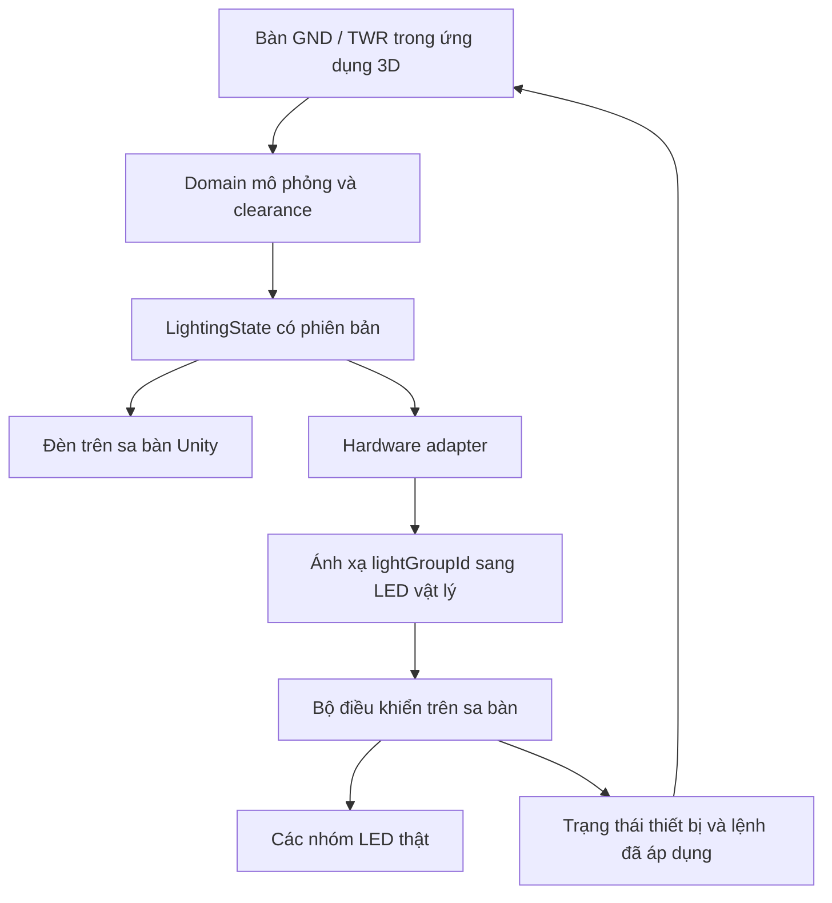

# NGOÀI PHẠM VI — Kế hoạch sa bàn LED vật lý trước khi làm rõ yêu cầu

**KHÔNG TRIỂN KHAI TÀI LIỆU NÀY. Người dùng đã làm rõ yêu cầu cuối cùng: chỉ dựng sa bàn 3D trên máy tính, máy bay tự chạy trong mô phỏng. Không làm LED thật hoặc sa bàn vật lý.**

Nội dung dưới đây chỉ lưu lại phương án đã bị thay thế, không còn là yêu cầu hay danh sách công việc cho Luna. Kế hoạch có hiệu lực là `ke_hoach_ban_giao_luna_3d.md` và `dinh_huong_sa_ban_3d.md`. Chưa mua linh kiện, chưa triển khai firmware hay kết nối thiết bị.

## 1. Phạm vi xác nhận và thông tin còn thiếu

| Nội dung | Trạng thái |
| --- | --- |
| Sa bàn số Unity, model Blender | Đã xác nhận |
| Sa bàn vật lý có đèn LED | Đã xác nhận |
| Dùng chung thao tác điều hành và trạng thái đèn | Mục tiêu tích hợp |
| Kích thước, tỷ lệ sa bàn | Đang hỏi người dùng |
| Ngân sách, vật liệu, linh kiện đã có | Đang hỏi người dùng |
| Máy bay đứng yên / di chuyển tay / tự chạy | Đang hỏi người dùng; không tự suy đoán |
| Máy tính và đường kết nối tới bộ điều khiển | Chốt sau kiểm kê phần cứng |

Chưa chốt thông số điện, model board, loại LED, số nguồn hoặc dây dẫn. Luna phải tra datasheet chính thức của linh kiện thực tế trước khi thiết kế các phần này.

## 2. Kiến trúc đồng bộ



Simulation domain quyết định đèn; hardware adapter chuyển đổi và truyền lệnh. Bộ điều khiển không tự tính route hoặc tự cấp quyền runway. Web 2D chưa tham gia kết nối này.

Hai đầu ra dùng chung state revision nhưng không bảo đảm sáng đúng cùng một mili-giây. Phải đo độ trễ và trình bày trạng thái đồng bộ. Phân biệt “đã gửi”, “thiết bị đã nhận”, “thiết bị đã áp dụng”; không gọi “LED thật đã sáng” nếu chỉ có ACK phần mềm và không có cảm biến kiểm chứng ánh sáng.

## 3. Định danh, phân vùng và bản đồ đèn

Không nối trực tiếp edgeId vào số chân điện. Tạo ba lớp:

1. **Vùng nghiệp vụ:** taxiway segment, holding line, runway, apron.
2. **Nhóm ánh sáng logic:** `lightGroupId`, loại, vị trí dọc tuyến, màu/trạng thái/độ sáng.
3. **Địa chỉ vật lý:** boardId, channelId, LED index hoặc output address theo linh kiện được chọn.

Tạo `airport-3d/data/hardware/light-mapping.json` với schemaVersion, layoutHash, mappingVersion, boardId, lightGroupId, vị trí hình học, địa chỉ output, hướng thứ tự và khả năng của thiết bị. Một nhóm logic có thể ánh xạ nhiều LED. Số LED vật lý và số điểm render 3D không cần bằng nhau, nhưng phải biểu diễn cùng đoạn tuyến.

Chia sa bàn thành các module tháo được, ví dụ runway, taxiway Tây, taxiway Đông, apron. Ranh giới module là quyết định sau khi biết kích thước/thi công; không hard-code board cho từng vùng ngay lúc này. Mỗi module cần đầu nối, nhãn và đường tiếp cận mặt dưới để sửa chữa.

## 4. Hợp đồng truyền thông độc lập linh kiện

Luna định nghĩa giao thức trước khi chọn USB/serial hoặc mạng. Chỉ chọn transport sau kiểm tra máy tính, board, khoảng cách và yêu cầu trình diễn.

| Bản tin | Nội dung |
| --- | --- |
| HELLO | deviceId, firmwareVersion, protocolVersion, mappingVersion, capabilities |
| FULL_STATE | sessionId, sequence, revision, toàn bộ nhóm đèn và trạng thái |
| DELTA | revision gốc, revision mới, nhóm thay đổi; chỉ dùng sau full state hợp lệ |
| ACK / APPLIED | sequence/revision nhận hoặc đã áp dụng, mã kết quả |
| HEARTBEAT | thiết bị đang hoạt động, revision gần nhất, lỗi có thể báo |
| ERROR | mapping sai, phiên bản không hỗ trợ, gói lỗi, lỗi output nếu thiết bị phát hiện được |
| TEST_GROUP | chế độ kỹ thuật, chọn nhóm và thời gian test; không tác động clearance |

Thiết kế framing, checksum, giới hạn gói, timeout, retry và chống gói trùng theo transport thực tế. Thiết bị bỏ sequence cũ, từ chối mapping không phù hợp. Không nhận lệnh tự do không có phạm vi từ nguồn không được phép.

## 5. Luồng vận hành chung

1. Mở mô phỏng → nạp layout và mapping → phát hiện thiết bị.
2. Handshake → đối chiếu phiên bản/capabilities → gửi full state.
3. Chỉ báo “đồng bộ” sau phản hồi applied tương ứng; nếu chưa có thiết bị, hiện “3D độc lập”.
4. KSVKL cấp tuyến → readback đúng → domain cập nhật clearance và LightingState.
5. Unity cập nhật đèn số; adapter gửi thay đổi sang board.
6. Board áp dụng output → trả revision; UI cập nhật trạng thái liên kết.
7. Hold/reroute/cancel/reset đều tạo revision ánh sáng mới; không gửi các hiệu ứng tùy ý ngoài state.

## 6. Mất kết nối, pause và chế độ trình diễn

- **Mất kết nối:** hiển thị lỗi rõ trên UI; board áp dụng trạng thái timeout cấu hình cho sa bàn giáo dục, không giữ vô hạn tín hiệu xanh cũ. Cụ thể tắt/đỏ nhóm nào phải định nghĩa theo khả năng phần cứng, không mặc định mọi đầu ra có màu đỏ.
- **Nối lại:** handshake và full state; không phát lại toàn bộ hàng lệnh cũ. Nếu board vừa khởi động, không coi revision trước reset còn hiệu lực.
- **Pause:** freeze mô phỏng; đèn giữ snapshot có nhãn PAUSED trên màn hình. Heartbeat thiết bị vẫn hoạt động theo thời gian thực để biết kết nối còn sống.
- **Reset:** session mới, xóa queue cũ, gửi full state mới.
- **Trưng bày đèn:** pause và khóa clearance; người xem biết đây là trình diễn hệ thống. Khi thoát, khôi phục state vận hành từ domain.
- **Test dây/nhóm:** giao diện kỹ thuật riêng; bật tuần tự nhóm để đối chiếu vị trí thật, không đánh dấu máy bay đã được cấp tuyến.

## 7. Vị trí máy bay vật lý — ba phạm vi khác nhau

| Phương án | Cách đồng bộ | Việc cần làm thêm |
| --- | --- | --- |
| Đứng yên | LED biểu diễn route/progress ảo; tàu vật lý chỉ minh họa | Nhãn rõ vị trí số không phải vị trí đo của tàu thật |
| Di chuyển bằng tay | Người vận hành xác nhận mốc đi qua, hoặc dùng cảm biến nếu có | Chọn chế độ bước theo mốc; không để clock ảo chạy xa khỏi tay người di chuyển |
| Tự chạy | Điều khiển cơ cấu chuyển động, đo vị trí và xử lý sai lệch | Dự án cơ điện riêng: cơ cấu, feedback, nguồn, tốc độ, kẹt/lệch, dừng và hiệu chuẩn |

Chưa chọn một phương án. Nếu dùng cảm biến, phải phân biệt pose mô phỏng và pose đo được. Không dùng LED animation làm bằng chứng tàu vật lý đã qua giao lộ. Cơ chế tự chạy không được gộp vào firmware LED như một việc nhỏ.

## 8. Các gói việc cho Luna

### H01 — Thu thập và khóa yêu cầu

Kích thước, tỷ lệ, vùng cần làm, số nhóm/điểm đèn, khoảng cách người xem, ngân sách, vật liệu, linh kiện có sẵn, cách di chuyển tàu, phương án giao tiếp. Đầu ra `hardware-requirements.md`, bảng quyết định và điểm chưa rõ.

### H02 — Thiết kế layout thi công

Dùng cùng layout với Unity; xuất sơ đồ mặt trên, phân module, tọa độ lỗ/đèn, mã nhóm và bản đồ đấu nối khái niệm. Kiểm tra tỷ lệ in bằng đoạn chuẩn. Đầu ra PDF/SVG/vector và mapping có version. Kích thước chưa chốt thì chỉ tạo bản tham số, không gọi là bản thi công cuối.

### H03 — Adapter giả lập, chưa cần linh kiện

Tạo `ILightingOutput`, mock device và UI trạng thái. Test handshake, applied, timeout, gói trùng, sai mapping, reconnect/reset, trưng bày/khôi phục. Đây là phần có thể làm ngay song song với sa bàn Unity.

### H04 — Chọn linh kiện và thiết kế điện

Sau H01: lập BOM với số lượng và lý do; kiểm tra datasheet chính thức cho mức điện áp, dòng, logic và giới hạn output. Tính nguồn/dây/phân phối theo trường hợp tải lớn nhất và cách chia module; mô tả bảo vệ, đầu nối, nhãn, tắt nguồn và bảo trì. Đánh giá nhiệt và độ sụt áp qua thử nghiệm thật. Không đưa thông số nguồn/dây chung chung khi chưa biết LED. Chưa mua hàng nếu chưa có chỉ dẫn mua.

### H05 — Prototype một cụm đèn

Làm một đoạn taxiway, một Stop Bar và một giao điểm; firmware nhận full state và trả applied. Test chức năng, disconnect và bật/tắt nguồn. Chỉ mở rộng khi cụm mẫu ổn định. Luna viết code/tài liệu; phần lắp ráp vật lý cần người có thiết bị thực hiện và cung cấp kết quả đo/ảnh.

### H06 — Mở rộng toàn sa bàn

Lắp theo module, kiểm tra từng nhóm, cập nhật mapping đúng thực tế, gắn nhãn, kiểm tra địa chỉ/hướng LED và tổng tải. Không thay graph logic để chữa lỗi đấu dây; sửa mapping hoặc phần lắp đặt.

### H07 — Nghiệm thu đồng bộ

Chạy cùng các bài cơ bản arrival/departure/hold/FOD/handoff trên Unity và sa bàn thật. Lưu command/revision/applied và đo độ trễ. Kiểm tra unplug, reconnect, reset board, đổi chế độ và vận hành kéo dài. Test cơ cấu máy bay chỉ sau khi phương án di chuyển đã được chốt và làm xong.

## 9. Tiêu chí hoàn thành phần LED

- Có mapping kiểm chứng tại sa bàn thật, cùng layout/version với Unity.
- Mỗi nhóm đèn phản ánh trạng thái đúng; route preview không tự thành tín hiệu cho phép.
- UI báo trạng thái gửi/nhận/applied/lỗi trung thực.
- Mất kết nối và reset không để tín hiệu cũ gây hiểu nhầm; nối lại phục hồi từ full state.
- Nguồn, phân phối và linh kiện được tính theo phần cứng thực, kiểm tra trên mẫu trước khi mở rộng.
- Có source firmware, adapter, BOM, sơ đồ, hướng dẫn lắp/test và biên bản nghiệm thu.
- Chưa có phần cứng thì chỉ được báo hoàn tất mock/phần mềm, không báo sa bàn LED đã hoạt động.

## 10. Bổ sung prompt Luna

```text
Người dùng xác nhận cả sa bàn 3D Unity và sa bàn vật lý LED thật.
Đọc docs/ke_hoach_sa_ban_led.md. Dùng một LightingState cho hai đầu ra.
Trong khi chưa chốt kích thước, linh kiện và kiểu di chuyển tàu, làm
mapping schema, ILightingOutput và mock device trước. Không tự chọn
thông số điện, mua linh kiện hoặc tuyên bố LED thật đã chạy khi mới
có mock. Hoàn thiện sa bàn số và các luồng KSVKL như kế hoạch chính.
```
