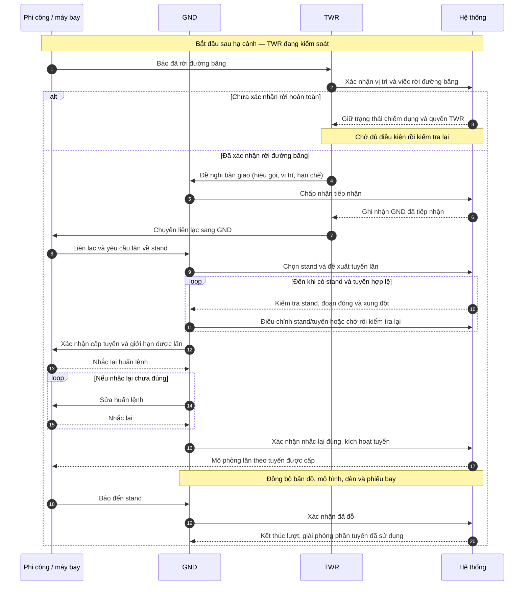

# Luồng phối hợp KSVKL trong mô phỏng

Bản thiết kế cho mô phỏng giáo dục, không phải quy trình khai thác thực tế. Ứng dụng hiện có bản đầu của chế độ thực hành GND/TWR: gán quyền theo chuyến bay, điểm dừng chờ, bàn giao, xác nhận readback và bước TWR trước runway. Các nhánh còn thiếu được liệt kê trong `docs/web_3d_status.md`; mọi phân công/ngưỡng cần được rà với rule inventory trước khi mở rộng.

## Cách đọc và phân làn

Các sơ đồ dùng làn dọc: thời gian đi từ trên xuống, mũi tên ngang thể hiện yêu cầu, huấn lệnh, báo cáo hoặc bàn giao giữa các bên. Khung `alt` là nhánh điều kiện; khung `loop` là bước phải kiểm tra lại.

| Làn | Trách nhiệm trong bản mô phỏng |
| --- | --- |
| Phi công / máy bay | Gửi yêu cầu, nhắc lại huấn lệnh, thực hiện và báo cáo vị trí. Có thể do mô phỏng đóng vai. |
| GND | Kiểm tra pushback, chọn stand và tuyến lăn, cấp/đổi tuyến, giữ và cho lăn tiếp. |
| TWR | Xử lý phần đường băng, xác nhận rời đường băng, tiếp nhận/bàn giao và cấp phép vào đường băng. |
| Hệ thống | Kiểm tra điều kiện, hiển thị cảnh báo, ghi nhận quyết định, cập nhật phiếu bay, vị trí và đèn. |

Giám sát là vai mở rộng sau, chưa cần thêm một làn cho bản đầu tiên. Hệ thống hỗ trợ quyết định; tuyến đề xuất hoặc đèn xanh không tự thay thế thao tác cấp phép của KSVKL.

## 1. Máy bay đến: đường băng → stand



## 2. Máy bay đi: stand → điểm chờ → đường băng

```mermaid
sequenceDiagram
    autonumber
    participant P as Phi công / máy bay
    participant G as GND
    participant T as TWR
    participant S as Hệ thống
    P->>G: Yêu cầu pushback từ stand
    G->>S: Chọn hướng, kiểm tra vùng pushback
    loop Nếu vùng pushback chưa thông thoáng
        G-->>P: Chờ tại stand
        S-->>G: Cập nhật điều kiện để kiểm tra lại
    end
    G->>P: Cho phép pushback theo hướng đã chọn
    P-->>G: Nhắc lại huấn lệnh
    G->>S: Xác nhận nhắc lại đúng
    S-->>P: Mô phỏng lùi khỏi stand
    P->>G: Báo hoàn tất pushback, yêu cầu lăn
    G->>S: Chọn tuyến đến điểm chờ
    loop Nếu tuyến bị đóng hoặc có xung đột
        S-->>G: Báo vị trí và nguyên nhân
        G->>S: Chọn tuyến khác hoặc giữ chờ rồi kiểm tra lại
    end
    G->>P: Cấp tuyến và yêu cầu dừng tại điểm chờ
    P-->>G: Nhắc lại huấn lệnh
    G->>S: Xác nhận nhắc lại đúng, kích hoạt tuyến
    S-->>P: Mô phỏng lăn đến điểm chờ rồi dừng
    P->>G: Báo tại điểm chờ
    G->>T: Đề nghị bàn giao (vị trí, tuyến, hạn chế)
    alt TWR chưa tiếp nhận
        T-->>G: Chưa tiếp nhận
        Note over P,S: Máy bay tiếp tục dừng; GND giữ quyền điều khiển
    else TWR chấp nhận
        T->>S: Xác nhận tiếp nhận
        S-->>G: Ghi nhận TWR đã tiếp nhận
        G->>P: Chuyển liên lạc sang TWR
        P->>T: Liên lạc tại điểm chờ
        T->>S: Kiểm tra điều kiện vào đường băng
        alt Chưa đủ điều kiện
            T-->>P: Tiếp tục giữ tại điểm chờ
            Note over T,S: Kiểm tra lại trước khi cấp phép
        else Đủ điều kiện
            T->>P: Xác nhận cho phép vào đường băng
            P-->>T: Nhắc lại huấn lệnh
            T->>S: Xác nhận nhắc lại đúng, mở giới hạn di chuyển
            S-->>P: Mô phỏng vào đường băng
        end
    end
    Note over P,S: Kết thúc phạm vi luồng mặt đất; vào đường băng không đồng nghĩa được cất cánh
```

Với mọi huấn lệnh, nhắc lại sai hoặc chưa có phản hồi phải quay về bước sửa/nhắc lại; không cho máy bay thực hiện bước mới.

## 3. Hai máy bay cùng muốn qua nút giao

```mermaid
sequenceDiagram
    autonumber
    participant A as Máy bay A
    participant B as Máy bay B
    participant G as GND
    participant S as Hệ thống
    S-->>G: Phát hiện hai tuyến cùng sử dụng nút giao
    G->>B: Giữ trước nút giao tại vị trí chờ
    B-->>G: Nhắc lại và báo đang giữ
    G->>S: Xác nhận B đã giữ, kiểm tra nút giao
    alt Nút giao thông thoáng và B đã giữ
        G->>A: Cho phép lăn qua nút giao
        A-->>G: Nhắc lại huấn lệnh
        G->>S: Xác nhận nhắc lại đúng, cấp đoạn tuyến cho A
        S-->>A: Mô phỏng A qua nút giao
        A-->>G: Báo đã qua
        S-->>G: Xác nhận toàn bộ máy bay A đã ra khỏi vùng xung đột
        G->>B: Cho phép lăn tiếp
        B-->>G: Nhắc lại huấn lệnh
        G->>S: Xác nhận nhắc lại đúng, cấp đoạn tuyến cho B
        S-->>B: Mô phỏng B qua nút giao
    else Chưa đủ điều kiện
        G-->>A: Giữ trước nút giao
        Note over A,S: Tiếp tục theo dõi và kiểm tra lại; chưa cấp quyền qua nút giao
    end
```

Nếu phát hiện đoạn đóng: hệ thống báo GND → GND giữ máy bay ở vị trí phù hợp → chọn tuyến vòng → hệ thống kiểm tra lại → GND cấp lại tuyến → phi công nhắc lại → GND xác nhận → cập nhật tuyến và đèn. Nếu không có tuyến hợp lệ, tiếp tục giữ.

## 4. Chuyển thành thao tác trên giao diện

Phiếu bay cần thể hiện: hiệu gọi, vị trí, stand, đích đến, người kiểm soát, bước hiện tại, tuyến dự kiến, tuyến đã cấp, giới hạn di chuyển, trạng thái nhắc lại và yêu cầu bàn giao đang chờ.

| Bước | Người thao tác | Nút / lựa chọn | Điều kiện và phản hồi |
| --- | --- | --- | --- |
| Chuẩn bị tuyến | GND | Chọn stand, chọn tuyến, kiểm tra | Hiện tuyến dự kiến; chưa cho di chuyển |
| Cấp tuyến | GND | Xác nhận cấp tuyến | Tuyến hợp lệ; chờ nhắc lại |
| Thực hiện | Người đang kiểm soát | Xác nhận nhắc lại đúng | Chỉ kích hoạt phạm vi đã được cấp |
| Pushback | GND | Chọn hướng, cho phép pushback | Vùng pushback hợp lệ; chờ nhắc lại |
| Giữ / lăn tiếp | GND hoặc TWR theo quyền hiện tại | Giữ, cho lăn tiếp | Không vượt giới hạn đã cấp; lăn tiếp phải kiểm tra lại |
| Bàn giao | Bên đang kiểm soát | Đề nghị bàn giao | Hiện người gửi, người nhận, vị trí, hạn chế |
| Tiếp nhận | Bên nhận | Chấp nhận / từ chối | Chỉ đổi người kiểm soát khi chấp nhận; ghi lịch sử |
| Vào đường băng | TWR | Cho phép vào đường băng | Đã nhận bàn giao, đủ điều kiện, nhắc lại đúng |
| Hoàn thành | GND | Xác nhận đã đỗ | Đúng stand và máy bay đã dừng |

Trong bản một người chơi, người dùng chuyển bàn GND/TWR; quyền thao tác vẫn được kiểm tra theo bàn đang chọn. Phi công có thể tự phản hồi sau một khoảng trễ mô phỏng. Phải thể hiện rõ khi chưa phản hồi hoặc phản hồi sai.

## 5. Ánh xạ vào dự án hiện tại

- `src/types.ts`: trạng thái thực hành giữ `practiceMode`, vai trò hiện chọn, người kiểm soát theo máy bay, yêu cầu bàn giao và readback; trạng thái điều khiển tách khỏi trạng thái chuyển động.
- `src/simulation/simulator.ts`: chế độ thực hành chặn nhận tuyến/bắt đầu sai vai; dừng tại holding point khi chờ bàn giao GND→TWR; giữ trước điểm vào runway và trước readback; chế độ tự chạy không bật các chặn thực hành.
- `src/components/ControlPanel.tsx`: có công tắc, chọn vai, gửi/nhận bàn giao, TWR cấp bước runway, xác nhận readback và hiển thị người đang kiểm soát.
- `src/components/StatusPanel.tsx`: hiển thị phiếu bay, người kiểm soát và bước tiếp theo.
- `src/components/AirportMap.tsx`: phản ánh tuyến, vị trí và đèn từ trạng thái mô phỏng.
- `SimulationState.liveEventLog`: ghi người thực hiện, máy bay, thời điểm, nội dung cấp phép/bàn giao và kết quả.

Đã có bản đầu bàn giao và các điểm dừng như trên; pushback/tug, readback theo nội dung, xử lý xung đột nút giao và toàn bộ nhánh đến/đi vẫn chưa hoàn chỉnh. Renderer 2D/3D nhận cùng SimulationState nên cùng phản ánh các lần dừng và tiếp tục.

## 6. Tiêu chí kiểm tra khi triển khai

1. Không nhận bàn giao: người kiểm soát không đổi; máy bay vẫn dừng ở giới hạn đã cấp.
2. Chưa nhắc lại đúng: không thực hiện huấn lệnh mới.
3. GND không thể cấp phép vào đường băng; TWR phải tiếp nhận và xác nhận riêng.
4. Tuyến hợp lệ lúc đề xuất nhưng bị đóng trước khi xác nhận: từ chối kích hoạt và yêu cầu kiểm tra lại.
5. Hai máy bay tranh nút giao: chỉ một máy bay được cấp quyền sử dụng vùng xung đột tại một thời điểm.
6. Đến điểm chờ: máy bay tự dừng dù phần tuyến hình học còn kéo dài vào đường băng.
7. Bản đồ, phiếu bay và đèn cùng phản ánh một trạng thái; tuyến dự kiến được phân biệt với tuyến đã cấp.
