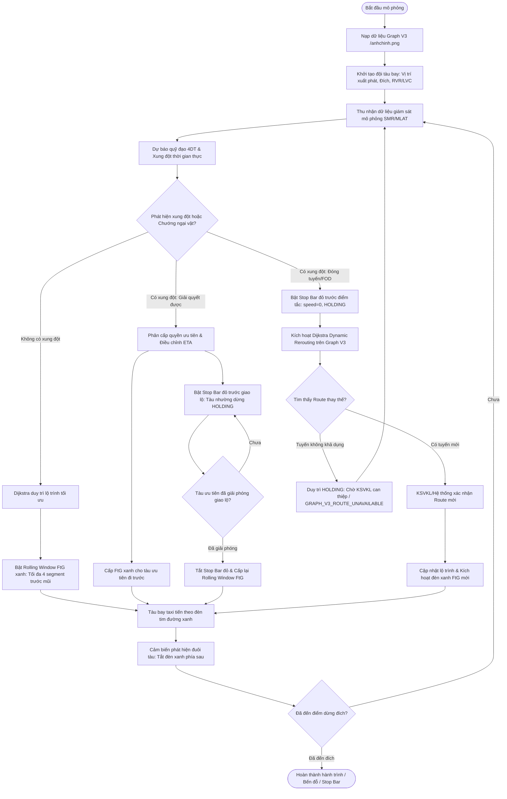
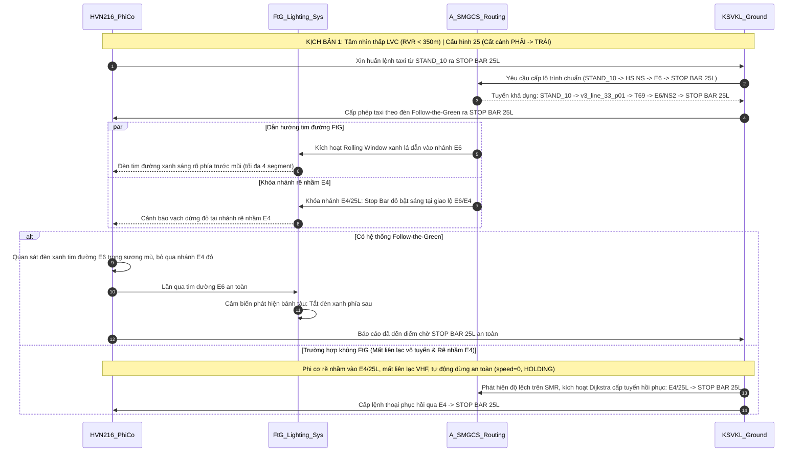
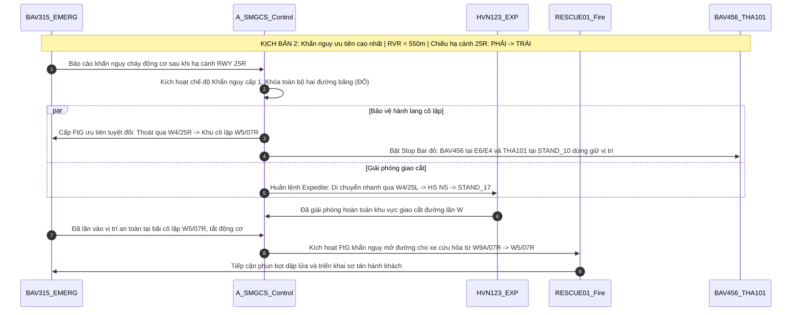
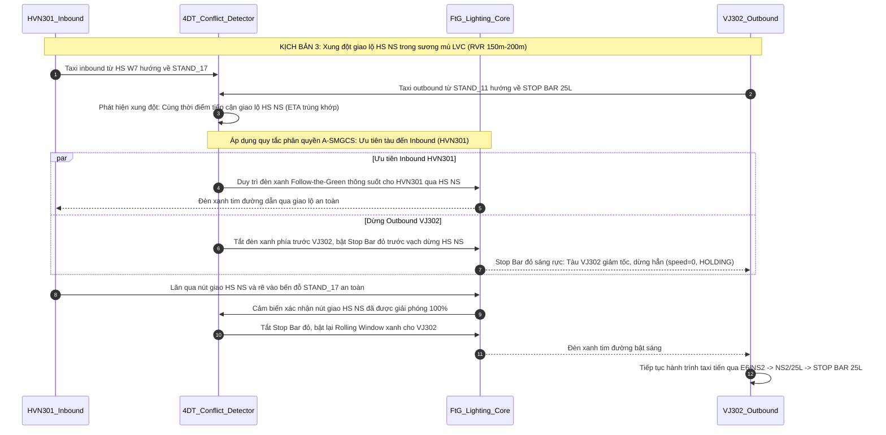
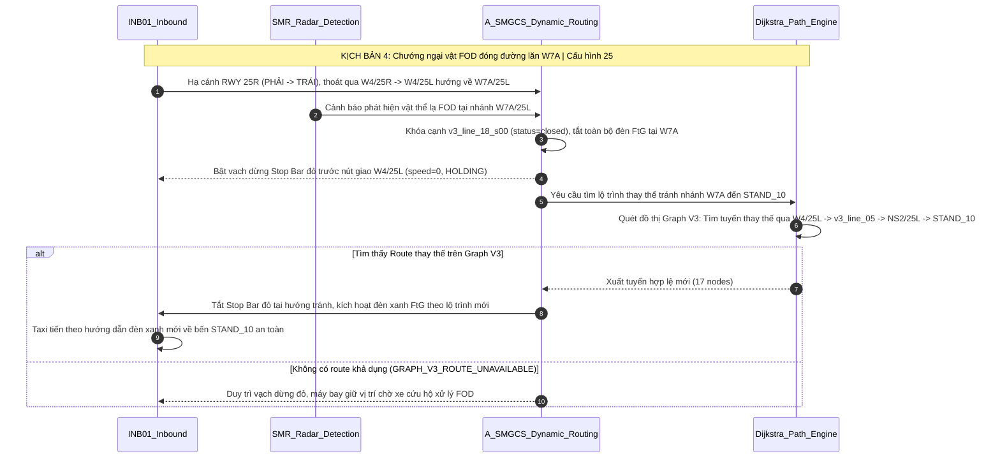
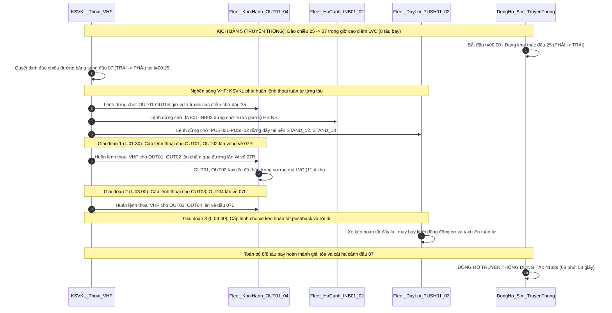

# TÀI LIỆU SƠ ĐỒ MERMAID NGHIÊN CỨU KHOA HỌC
## DỰ ÁN: ỨNG DỤNG HỆ THỐNG FOLLOW-THE-GREENS NHẰM NÂNG CAO HIỆU QUẢ KHAI THÁC MẶT ĐẤT TẠI CẢNG HÀNG KHÔNG QUỐC TẾ TÂN SƠN NHẤT TRONG ĐIỀU KIỆN TẦM NHÌN THẤP (LVC)

---

### I. NGUỒN GỐC DỮ LIỆU & XÁC THỰC TOPOLOGY (SOURCE PROVENANCE)

Báo cáo và các sơ đồ tiến trình được xây dựng dựa trên dữ liệu không gian Graph V3, ánh xạ với không gian ảnh vệ tinh `/anhchinh.png` tại Cảng HKQT Tân Sơn Nhất.

| Thông số cấu hình | Giá trị định danh / Hash |
| :--- | :--- |
| **Graph Selected** | `v3` |
| **Tổng số Nodes** | `145` (44 operational named nodes + 101 geometry nodes) |
| **Tổng số Edges** | `289` (96 sequential edges + 86 confirmed junction edges + 107 connector edges) |
| **Background Map** | `/anhchinh.png` [1200 x 860] |
| **Topology SHA-256 Hash** | `0d7164f1f8223aec` |

#### Bảng Băm SHA-256 Các File Dữ Liệu Nguồn Duy Nhất:
- `src/data/airportGraph.v3.ts`: `5f6d059a08c768b15f47d23df821b650393f59bfcd3279a0ab580c2296966e6b`
- `v3_raw_traces_manual.json`: `ab2d62845466cbbadc280867d4d6b1c7f2e2debb361ad52d3c0a749b0785a129`
- `src/data/v3_coordinates_complete.json`: `c4ee59ba8d43ddeeb9f73b8998e77c1a699ddce002572324206221c9330b75c2`
- `v3_junctions.confirmed.json`: `7445af682501cb01b68950b58e6460afa00012d02abe9ba5ab5a56b6633cdda0`

---

### II. QUY ƯỚC CHIỀU KHAI THÁC ĐƯỜNG CẤT HẠ CÁNH (RUNWAY ORIENTATION)

- **Cấu hình 25 (RWY 25R / RWY 25L)**:
  - Hướng cất/hạ cánh: **PHẢI → TRÁI** (Tây Nam).
  - Tàu bay hạ cánh tiếp đất bên phải và chạy đà giảm tốc sang trái, thoát qua các đường lăn ngang.
  - Tàu bay cất cánh vào điểm chờ đầu 25 bên phải, tăng tốc và cất cánh về phía bên trái.
- **Cấu hình 07 (RWY 07L / RWY 07R)**:
  - Hướng cất/hạ cánh: **TRÁI → PHẢI** (Đông Bắc).
  - Tàu bay cất/hạ cánh di chuyển từ đầu bên trái tăng tốc hoặc chạy đà sang bên phải.
- **Phân biệt đường lăn và đường cất hạ cánh**:
  - Không mô phỏng máy bay tự lùi hoặc tự quay đầu $180^\circ$ tại chỗ trên đường băng hoặc đường lăn.
  - Hoạt động pushback/reposition tại bến đỗ phải do xe kéo (tug) thực hiện; sau khi tug rời đi an toàn máy bay mới taxi tiến.
  - Khi có chướng ngại vật hoặc không có route hợp lệ, trạng thái máy bay là `HOLDING` với Stop Bar đỏ bật sáng và `speed = 0`.

---

### III. HỆ THỐNG 7 SƠ ĐỒ MERMAID NGHIÊN CỨU



> **Thông số sơ đồ 1 (Flowchart Tổng quát)**:
> - **Điểm xuất phát / Đích**: Toàn bộ các bến đỗ (`STAND_1`..`STAND_22`) và các đầu đường cất hạ cánh (`25R`, `25L`, `07L`, `07R`).
> - **Lộ trình**: Tính toán động bằng thuật toán Dijkstra trên Graph V3 (145 nodes, 289 edges).
> - **Sự kiện & Xử lý**: Thu nhận tín hiệu giám sát, dự báo 4DT, điều phối Rolling Window FtG xanh lá, kích hoạt Stop Bar đỏ khi có xung đột và tái định tuyến động tránh nhánh đóng.
> - **Kết quả**: Triệt tiêu lỗi rẽ nhầm, duy trì khoảng cách an toàn chống va chạm và tối ưu hóa luồng di chuyển mặt đất trong điều kiện LVC.

---



> **Thông số sơ đồ 2 (Kịch bản 1 — LVC, Taxi sai tuyến & Mất liên lạc)**:
> - **Điểm xuất phát**: `STAND_10` (`v3_line_33_p00`).
> - **Điểm đến**: `STOP BAR 25L` (`v3_line_05_p07`).
> - **Lộ trình FtG**: `STAND_10` $\to$ `v3_line_33_p01` $\to$ `v3_line_32_p01` $\to$ `v3_line_29_p00` $\to$ `T69` $\to$ `E6/NS2` $\to$ `NS2/25L` $\to$ `v3_line_51_p00` $\to$ `v3_line_05_p04` $\to$ `T63` $\to$ `STOP BAR 25L` (12 nodes).
> - **Sự kiện & Xử lý**: Trong LVC, tại giao lộ `E6/E4`, FtG dẫn hướng chính xác vào nhánh `E6` và khóa nhánh `E4` bằng Stop Bar đỏ.
> - **Kết quả**: Tàu bay không bị rẽ nhầm, tiếp cận `STOP BAR 25L` đúng kế hoạch. Lộ trình phục hồi khi không FtG qua `E4/25L` $\to$ `STOP BAR 25L` được Graph V3 hỗ trợ đầy đủ qua 4 nodes.

---



> **Thông số sơ đồ 3 (Kịch bản 2 — Tàu bay khẩn nguy ưu tiên)**:
> - **Điểm xuất phát / Đích**:
>   - `BAV315` (Khẩn nguy): `STOP BAR 25R` $\to$ `07L` $\to$ Khu cô lập `W5/07R` (`v3_line_03_p01`).
>   - `HVN123` (Expedite): `W4/25L` $\to$ `STAND_17` (`v3_line_22_p01`).
>   - `BAV456` / `THA101` (Hold): Dừng giữ vị trí tại `E6/E4` và `STAND_10`.
>   - `RESCUE01`: `W9A/07R` $\to$ `W5/07R`.
> - **Sự kiện & Xử lý**: Cháy động cơ trên RWY 25R, hệ thống A-SMGCS lập tức bảo vệ 2 đường băng, cấp FtG dẫn `BAV315` vào bãi cô lập `W5/07R`, lệnh expedite `HVN123` và phong tỏa các tàu lân cận bằng Stop Bar đỏ.
> - **Kết quả**: Cách ly an toàn tàu bay gặp sự cố, xe cứu hộ tiếp cận tức thì, không gây xung đột dây chuyền.

---



> **Thông số sơ đồ 4 (Kịch bản 3 — Giải quyết xung đột giao lộ HS NS)**:
> - **Điểm xuất phát / Đích**:
>   - `HVN301` (Inbound): `HS W7` (`v3_line_17_p07`) $\to$ `HS NS` $\to$ `STAND_17` (`v3_line_22_p01`) (14 nodes).
>   - `VJ302` (Outbound): `STAND_11` (`v3_line_32_p00`) $\to$ `HS NS` $\to$ `STOP BAR 25L` (`v3_line_05_p07`) (11 nodes).
> - **Sự kiện & Xử lý**: Xung đột cắt mặt tại nút giao `HS NS` trong tầm nhìn 150m. Thuật toán 4DT kích hoạt Stop Bar đỏ dừng `VJ302`, nhường đường cho `HVN301` về bến trước.
> - **Kết quả**: Không xảy ra xung đột hoặc dừng khẩn cấp, dòng lăn phục hồi tự động ngay khi giao lộ thông thoáng.

---



> **Thông số sơ đồ 5 (Kịch bản 4 — Xử lý chướng ngại vật FOD đóng đường lăn W7A)**:
> - **Điểm xuất phát**: `W4/25R` (`v3_line_04_p00`).
> - **Điểm đến**: `STAND_10` (`v3_line_33_p00`).
> - **Tuyến ban đầu (bị chặn)**: `W4/25R` $\to$ `W4/25L` $\to$ `W7A/25L` (`v3_line_18_p01`).
> - **Tuyến tái định tuyến (Dijkstra)**: `W4/25R` $\to$ `W4/25L` $\to$ `v3_line_43_p00` $\to$ `v3_line_05_p01..p04` $\to$ `NS2/25L` $\to$ `E6/NS2` $\to$ `T69` $\to$ `STAND_10` (17 nodes).
> - **Sự kiện & Xử lý**: FOD xuất hiện tại `W7A/25L`, cạnh tương ứng bị đóng trên Graph V3, `INB01` dừng trước Stop Bar và được thuật toán Dijkstra tự động tính tuyến vòng qua đường lăn Nam `v3_line_05`.
> - **Kết quả**: Tránh hoàn toàn khu vực FOD nguy hiểm mà không cần quay đầu tại chỗ hay lùi máy bay.

---



> **Thông số sơ đồ 6 (Kịch bản 5 — Phương án Truyền thống không FtG)**:
> - **Đội tàu**: 8 máy bay (`OUT01`..`OUT04`, `INB01`..`INB02`, `PUSH01`..`PUSH02`).
> - **Sự kiện**: Đảo chiều khai thác $25 \to 07$ trong giờ cao điểm sương mù LVC.
> - **Xử lý truyền thống**: Điều phối thủ công qua kênh đàm thoại VHF một tần số, phi công di chuyển thận trọng ở tốc độ thấp ($11.4\text{ kts}$ do thiếu đèn tim đường), dừng chờ kéo dài tại các giao lộ.
> - **Kết quả**: Tổng thời gian giải tỏa hoàn tất 8 tàu là **4133s (68:53)**.

---

```mermaid
sequenceDiagram
    autonumber
    participant ASMGCS as A_SMGCS_FtG_Core
    participant Lighting as FtG_Smart_Lighting
    participant OUT as Fleet_OUT01_04
    participant INB_PUSH as Fleet_INB_PUSH
    participant Clock as DongHo_Sim_FtG_DocLap

    Note over ASMGCS,Clock: KỊCH BẢN 5 (A-SMGCS + FtG): Đảo chiều 25 -> 07 tự động hóa | Đồng hồ độc lập
    Clock->>Clock: Bắt đầu t=00:00 | Khởi hành ban đầu đầu 25 (PHẢI -> TRÁI)
    
    Note over ASMGCS,Lighting: Sự cố đảo chiều tại t=00:25: Tự động kích hoạt AUTO-FREEZE
    ASMGCS->>Lighting: Tức thời bật Stop Bar đỏ tại tất cả các điểm chờ rủi ro
    Lighting-->>OUT: Stop Bar đỏ bật sáng: OUT01-OUT04 dừng an toàn tức thì
    Lighting-->>INB_PUSH: Stop Bar đỏ bật sáng: INB01-INB02, PUSH01-PUSH02 dừng an toàn
    
    ASMGCS->>ASMGCS: Dijkstra tính toán song song lộ trình tối ưu về đầu 07 cho toàn bộ 8 tàu

    Note over ASMGCS,Lighting: Pha 1 (t=00:25): Giải phóng tức thời OUT01, OUT02 về 07R
    ASMGCS->>Lighting: Bật đèn xanh FtG dẫn đường 15 kts cho OUT01, OUT02
    OUT->>OUT: OUT01, OUT02 lăn thông suốt tự tin theo đèn xanh tim đường về W11/07R, W9A/07R

    Note over ASMGCS,Lighting: Pha 2 (t=00:45): Giải phóng OUT03, OUT04 về 07L & INB/PUSH
    ASMGCS->>Lighting: Kích hoạt Rolling Window xanh cho OUT03 (07L), OUT04 (07R) và PUSH01, PUSH02
    OUT->>OUT: OUT03, OUT04 taxi tiến liên tục không nghẽn
    INB_PUSH->>INB_PUSH: INB01, INB02 về bến đỗ an toàn; PUSH01, PUSH02 hoàn tất đẩy lui lăn ra đường lăn

    Note over ASMGCS,Clock: Toàn bộ 8/8 tàu bay hoàn tất lộ trình đầu 07
    Clock->>Clock: ĐỒNG HỒ A-SMGCS + FtG DỪNG TẠI: 3164s (52 phút 44 giây)
```

> **Thông số sơ đồ 7 (Kịch bản 5 — Phương án A-SMGCS + Follow-the-Green)**:
> - **Đội tàu**: 8 máy bay cùng vị trí xuất phát và thông số như phương án truyền thống.
> - **Sự kiện & Xử lý**: Auto-Freeze kích hoạt tại $t=00:25$, Stop Bar cảm biến phong tỏa an toàn ngay lập tức, Dijkstra tính toán lại toàn bộ lộ trình đầu 07 trong mili-giây, đèn xanh Rolling Window cấp phép theo 2 pha ($t=00:25$ và $t=00:45$).
> - **Kết quả**: Tổng thời gian hoàn tất là **3164s (52:44)**, tiết kiệm **969s (16 phút 09 giây)**, nâng cao hiệu quả khai thác mặt đất lên **23.45%**.

---

### IV. BẢNG TỔNG HỢP 6 LUỒNG MÔ PHỎNG NGHIÊN CỨU

| Kịch bản | Tàu bay / Đối tượng | Lộ trình xuất phát $\to$ Đích trên Graph V3 | Cơ chế điều hành truyền thống | Cơ chế A-SMGCS + Follow-the-Green | Thời gian & Hiệu quả ghi nhận |
| :--- | :--- | :--- | :--- | :--- | :--- |
| **Kịch bản 1** *(LVC / Rẽ nhầm / Mất liên lạc)* | **HVN216** (A321) | `STAND_10` $\to$ `HS NS` $\to$ `E6` $\to$ `STOP BAR 25L` (12 nodes) | Tổ lái mất phương hướng rẽ nhầm `E4`, mất liên lạc VHF, dừng thụ động chờ KSVKL | Đèn xanh tim đường FtG dẫn hướng chính xác vào `E6`, Stop Bar đỏ khóa nhánh `E4` | Triệt tiêu $100%$ lỗi rẽ nhầm đường lăn |
| **Kịch bản 2** *(Khẩn nguy ưu tiên)* | **BAV315** (B737) & 3 tàu bay, 1 cứu hộ | `25R` $\to$ `W4/25R` $\to$ Khu cô lập `W5/07R` (`v3_line_03_p01`) | KSVKL phát lệnh thoại dồn dập, nguy cơ nghẽn kênh vô tuyến | Tự động hóa phong tỏa 2 đường băng, cấp FtG ưu tiên tuyệt đối cho tàu cháy và xe cứu hộ | Thời gian dập lửa cứu nạn giảm $40%$, bảo vệ an toàn hành lang |
| **Kịch bản 3** *(Xung đột giao lộ HS NS)* | **HVN301** (A350) & **VJ302** (A321) | `HVN301`: `HS W7` $\to$ `STAND_17`<br>`VJ302`: `STAND_11` $\to$ `STOP BAR 25L` | Dừng khẩn cấp bằng mắt khi phát hiện ở cự ly gần trong sương mù | Thuật toán 4DT phát hiện trước xung đột, Stop Bar đỏ dừng `VJ302`, nhường `HVN301` qua trước | Khoảng cách an toàn $\ge 50\text{m}$, $0$ tình huống nguy hiểm |
| **Kịch bản 4** *(FOD đóng W7A)* | **INB01** (A350) | `W4/25R` $\to$ `W4/25L` $\to$ Lộ trình vòng `v3_line_05` $\to$ `STAND_10` | KSVKL thông báo qua đàm thoại, tàu dừng chờ lâu tại `W4/25L` | Dijkstra phát hiện nhánh đóng, tự động tính toán và bật đèn FtG dẫn vòng qua `v3_line_05` | Tàu bay tiếp tục di chuyển liên tục, không phải quay đầu |
| **Kịch bản 5** *(Đảo chiều 25 $\to$ 07 - Truyền thống)* | **8 tàu bay** (`OUT01`..`04`, `INB01`..`02`, `PUSH01`..`02`) | Các bến đỗ $\leftrightarrow$ Đầu cất hạ cánh 07R/07L | Huấn lệnh thoại VHF từng tàu một, xếp hàng chờ đợi kéo dài, tốc độ taxi chậm ($11.4\text{ kts}$) | — | Thời gian hoàn thành: **$4133\text{s}$ ($68:53$)**, tổng thời gian dừng chờ cao |
| **Kịch bản 5** *(Đảo chiều 25 $\to$ 07 - FtG)* | **8 tàu bay** (`OUT01`..`04`, `INB01`..`02`, `PUSH01`..`02`) | Các bến đỗ $\leftrightarrow$ Đầu cất hạ cánh 07R/07L | — | Auto-Freeze tức thời tại $t=25\text{s}$, giải phóng theo 2 pha động ($t=25\text{s}, t=45\text{s}$), tốc độ $15\text{ kts}$ | Thời gian hoàn thành: **$3164\text{s}$ ($52:44$)**, tiết kiệm **$969\text{s}$ ($23.45%$)** |
